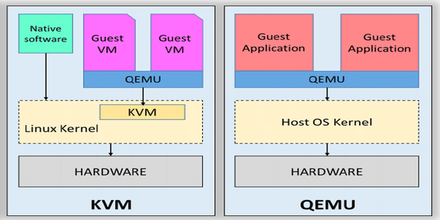
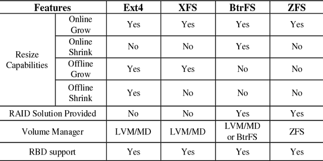
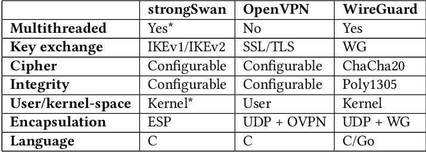

<!DOCTYPE html>
<html lang='en'>

<head>

<meta charset='UTF-8'>

<body>

<div id="header">

<h1>1. DEBIAN GNU/LINUX AND HARDENING</h1>

<blockquote><h3>"Encryption works. Properly implemented strong crypto systems are one of the few things that you can rely on. Unfortunately endpoint security is so terrifically weak that NSA can frequently find ways around it." (Edward Snowden)</h3></blockquote>


</div>

<hr>

<!--################################### -->

<h3>1.01 System Hardening Must Have</h3>

<table>
<tbody>
<tr>
<td> <a href="https://anonymousplanet.org/">Anonymous Planet - The Hitchhiker’s Guide</a><a href="https://anonymousplanet.org/export/guide.pdf"> (PDF)</a> </th>
<td> <a href="https://madaidans-insecurities.github.io/">Madaidan's - Security &amp; Privacy Evaluations</a> </th>
</tr>
<tr>
<td> <a href="https://www.whonix.org/wiki/Essential_Host_Security">Whonix - Essential Host Security</a> </td>
<td> <a href="https://hardenedlinux.github.io/">Hardened GNU/Linux</a> </td>
</tr>
<tr>
<td> <a href="https://www.whonix.org/wiki/System_Hardening_Checklist">Whonix - System Hardening Checklist</a> </td>
<td> <a href="https://www.bleachbit.org/">Bleachbit - Clean Your System and Free Disk Space</a> </td>
</tr>
<tr>
<td> <a href="https://www.kicksecure.com/wiki/Documentation">Kicksecure - Documentation</a> </td>
<td> <a href="https://github.com/PartialVolume/shredos.x86_64">ShredOS - Secure disk erasure/wipe</a> </td>
</tr>
<tr>
<td><a href="https://wiki.debian.org/SecurityManagement">Debian - Security Management</a></td>
<td> <a href="https://ssd.eff.org/">EFF - Surveillance Self-defense</a> </td>
</tr>
<tr>
<td> <a href="https://owasp.org/" target="_blank" rel="noopener noreferrer">OWASP - No more insecure software</a> </td>
<td> <a href="https://cryptomator.org/" target="_blank" rel="noopener noreferrer">Cryptomator - Put a lock on your cloud</a> </td>
</tr>
<tr>
<td> <a href="https://www.cisecurity.org/benchmark/debian_linux">CIS Benchmark - Debian Linux Guides</a> </td>
<td> <a href="https://www.duplicati.com/" target="_blank" rel="noopener noreferrer">Duplicati - Store securely encrypted backups on cloud storage services!</a> </td>
</tr>
<tr>
<td> <a href="https://www.nsa.gov/Press-Room/Cybersecurity-Advisories-Guidance">NSA GOV - Cybersecurity Advisories &amp; Guidance</a><a href="https://github.com/nsacyber"> (GitHub)</a> </td>
<td> <a href="https://www.virustotal.com/gui/home/upload" target="_blank" rel="noopener noreferrer">Virus Total - Free virus, malware and URL online scanning</a> </td>
</tr>
<tr>
<td> <a href="https://www.nist.gov/cyberframework">NIST GOV - Cybersecurity Framework</a> </td>
<td> <a href="https://www.hybrid-analysis.com/" target="_blank" rel="noopener noreferrer">Hybrid Analysis - This is a free malware analysis service</a></td>
</tr>
</tbody>
</table>

<sub>&nbsp; &nbsp; &nbsp; &nbsp;*Kernel Hacking Guides - https://docs.kernel.org/kernel-hacking/index.html</sub>

<hr>
<!--################################### -->

<h3>1.02 Essential Tools</h3>

<table style="width:100%" cellspacing="0" cellpadding="0">
<tr valign="top" style="width:50%">
<td><a href="https://www.ventoy.net/en/download.html" target="_blank"><b>1. Ventoy</b></a></td>
<td><a href="https://www.ventoy.net/en/doc_secure.html" target="_blank">(Secure Boot)</a></td>
<td><a href="https://www.ventoy.net/en/download.html" target="_blank">(Checksums)</a></td>
<td><a href="https://tails.net/news/new_domain/index.en.html" target="_blank"><b>6. Tails</b></a></td>
<td><a href="https://tails.net/contribute/design/UEFI/archive/" target="_blank">(Secure Boot)</a></td>
<td><a href="https://tails.net/install/index.en.html" target="_blank">(Checksums)</a></td>
</tr>
<tr valign="top" style="width:50%">
 <td><a href="http://www.rodsbooks.com/refind/getting.html" target="_blank"><b>2. rEFInd</b></a></td>
<td><a href="http://www.rodsbooks.com/refind/secureboot.html" target="_blank">(Secure Boot)</a></td>
<td><a href="https://sourceforge.net/p/refind/code/ci/master/tree/" target="_blank">(Checksums)</a></td> 
<td><a href="https://www.kali.org/get-kali/#kali-installer-images" target="_blank"><b>7. KaliLinux</b></a></td>
<td><a href="" target="_blank">(Secure Boot)</a></td>
<td><a href="" target="_blank">(Checksums)</a></td>
</tr>
 <tr>
<td><a href="https://clonezilla.org/downloads.php" target="_blank"><b>3. Clonezilla</b></a></td>
<td><a href="https://clonezilla.org/downloads.php" target="_blank">(Secure Boot)</a></td>
<td><a href="https://clonezilla.org/downloads.php" target="_blank">(Checksums)</a></td>
<td><a href="https://www.openpgp.org/software/" target="_blank"><b>8. OpenPGP</b></a></td>
<td><a href="https://github.com/OpenPGP/openpgp.org" target="_blank">(GitHub)</a></td>
<td><a href="https://keys.openpgp.org/" target="_blank">(Check)</a></td>
</tr>
<tr>
<td><a href="https://gparted.org/livecd.php" target="_blank"><b>4. GParted</b></a></td>
<td><a href="https://gparted.org/download.php" target="_blank">(Secure Boot)</a></td>
<td><a href="https://gparted.org/gpg-verify.php" target="_blank">(Checksums)</a></td>
<td><a href="https://learn.microsoft.com/en-us/windows-hardware/manufacture/desktop/winpe-intro?view=windows-11" target="_blank"><b>9. WinPE</b></a></td>
<td><a href="https://sergeistrelec.name/" target="_blank">(Sergei Strelec)</a></td>
<td><a href="https://sergeistrelec.name/version_history_en.html" target="_blank">(Checksums)</a></td>
</tr>
<tr>
<td><a href="https://github.com/PartialVolume/shredos.x86_64" target="_blank"><b>5. ShredOS</b></a></td>
<td><a href="" target="_blank">(Secure Boot)</a></td>
<td><a href="" target="_blank">(Checksums)</a></td>
<td><a href="https://www.hirensbootcd.org/" target="_blank"><b>10. Hiren's BootCD PE</b></a></td>
<td><a href="" target="_blank">(Secure Boot)</a></td>
<td><a href="https://www.hirensbootcd.org/download/" target="_blank">(Checksums)</a></td>
 </tr>
</table>

<!-- ################################## -->

<details>
<summary><sub>¹ Check hash with <a href="https://gtkhash.org">GtkHash (GUI)</a></sub></summary>
<br>

<p>Check hash with GtkHash (GUI) <a href="https://gtkhash.org">https://gtkhash.org</a></p>

<br>
</details>

<!-- ########## -->

<details>
<summary><sub>² How to summarize iso file with <a href="https://www.gnu.org/software/coreutils/manual/html_node/Summarizing-files.html">GNU Coreutils (CLI)</a></sub></summary>
<br>

<p>Summarize iso file with GNU Coreutils (CLI)<a href="https://www.gnu.org/software/coreutils/manual/html_node/Summarizing-files.html">https://www.gnu.org/software/coreutils/manual/html_node/Summarizing-files.html</a></p>

<br>
</details>

<!-- ########## -->

<details>
<summary><sub>³ Manual method with sha256sum</sub></summary>
<br>

<p>The SHA-256 checksum hashes in a file called SHA256SUMS in the same directory listing as the download page.</p>
<p>First install it</p>
<p><code>$ sudo apt install sha256sum</code></p>
<p>Open a terminal and go to the correct directory to check a downloaded iso file:</p>
<p><code>$ cd download_directory</code></p>
<p>Then run the following command from within the download directory.</p>
<p><code>$ sha256sum name.iso</code></p>
<p>sha256sum should then print out a single line after calculating the hash:</p>
<p><code>$ sdd31231c0421be56f39c7a31245c423fgcc3b048ds321a3e83d2c4d714fa9a76 *name.iso</code></p>
<p>Compare the hash (the alphanumeric string on left) that your machine calculated with the corresponding hash in the SHA256SUMS file.</p>

<br>
</details>

<!-- ########## -->

<details>
<summary><sub>⁴ Semi-automatic method with sha256sum</sub></summary>
<br>

<p>First download the SHA256SUMS and SHA256SUMS.gpg files to the same directory as the iso. Then run the following commands in a terminal.</p>
<p><code>$ cd download_directory</code></p>
<p><code>$ sha256sum -c SHA256SUMS 2>&1 | grep OK</code></p>
<p>The sha256sum line should output a line such as:</p>
<p><code>name.iso: OK</code></p>
<p>If the OK for your file appears, that indicates the hash matches.</p>

<br>
</details>

<hr>
<!-- ################################## -->

<h2>2. SYSTEM INSTALLATION</h2>

👷🛠️UNDER CONSTRUCTION🚧🏗<br>

<details>
<summary><b>2.01 Hardware</b></summary>
<br>

<h4>Points to check</h4>

<h4>2.01.01 Security</h4>

<h5>• BIOS</h5>

∙ Password Protect BIOS And OS With Laminated Password Card<br>
https://www.passwordcard.org/en<br>

∙ Boot
https://libreboot.org<br>
https://osresearch.net<br>

∙ Sanitize options<br> 

<p>Not all SSD support sanitize. And if you use SSDs, enable TRIM in your BIOS. More details in the rest of this work and in the attached files.</p>

∙ Crack password stored in CMOS used to access BIOS SETUP<br>
https://github.com/bacher09/pwgen-for-bios<br>

<h5>Hardware Vulnerabilities</h5>
https://docs.kernel.org/admin-guide/hw-vuln/index.html<br>
https://github.com/chipsec/chipsec<br>

<h5>• Hardware Security Based</h5>
https://en.wikipedia.org/wiki/Open-source_firmware<br>
https://en.wikipedia.org/wiki/Hardware-based_full_disk_encryption<br>
https://en.wikipedia.org/wiki/Write_protection<br>
https://en.m.wikipedia.org/wiki/Random-access_memory<br>
https://usbguard.github.io<br>
https://digistor.com<br>
https://www.seagate.com/enterprise-storage/enterprise-security<br>
https://github.com/openssl/openssl/blob/master/README-FIPS.md<br>

<h5>• Volatile Memory</h5>
https://usbkill.com<br>
https://github.com/Kicksecure/ram-wipe<br>
https://www.kicksecure.com/wiki/Hardened_Malloc<br>
https://forums.whonix.org/t/hardened-malloc-hardened-memory-allocator/7474/4<br>

<h5>• Hardware Spoof</h5>
https://www.whonix.org/wiki/Protocol-Leak-Protection_and_Fingerprinting-Protection#Less_important_identifiers<br>
https://www.whonix.org/wiki/MAC_Address<br>
https://github.com/alobbs/macchanger<br>
https://hwidspoofer.com<br>
https://xaze.gitbook.io/how-to-spoof-with-hwid-serial-changer<br>
https://github.com/segofensiva/OSfooler-ng<br>

<h4>2.01.02 Compatibility</h4>
https://linux-hardware.org<br>
https://ryf.fsf.org<br>
https://pine64.org/pinebook-pro<br>
https://frame.work<br>
https://powerpc-notebook.org<br>
https://github.com/morrownr/USB-WiFi<br>
	
<h4>2.01.03 Performance</h4>

• SSD Over-provisioning<br>

<p>This prevents degradation of SSD speed and durability.</p>

<p>Depending on use, some manufacturers recommend 40% OP. For general use, 20% of the general capacity of the SSD, that is, more or less 14% counting the minimum that comes from the factory. For example, a 240GB SSD is limited to -14%, which results in 206GB (34GB of OP).</p>

<p>You must consider the file system you will use.</p>


<h4>2.01.04 Cost benefit</h4>


<br>
</details>

<!-- ########## -->

<details>
<summary><b>2.02 Installation</b></summary>
<br>

<h4>Visit our repo tree: https://github.com/RENANZG/My-Debian-GNU-Linux/tree/main/2.SYSTEM_INSTALLATION</h4>

2.02.01 Basic Installation Guide<br>

• Basic tips about Linux System<br>

Debian Wiki - https://wiki.debian.org/FrontPage<br>
Command Line - https://github.com/jlevy/the-art-of-command-line#everyday-use<br>
Terminal - https://github.com/onceupon/Bash-Oneliner#terminal-tricks<br>

• Bash autocompletion with TAB<br>

<code>$ sudo apt install bash-completion</code>

<h4>Overview of Terminal's Shortcuts</h4>

<table>
<thead>
<tr>
<th>Shortcut</th>
<th>Action</th>
<th>Shortcut</th>
<th>Action</th>
</tr>
</thead>
<tbody>
<tr>
<td>Esc + t</td>
<td>Swap the two words before the cursor</td>
<td>Ctrl + f</td>
<td>Go forward one character</td>
</tr>
<tr>
<td>Ctrl + r</td>
<td>Search command history</td>
<td>Ctrl + b</td>
<td>Go back one character</td>
</tr>
<tr>
<td>Ctrl + g</td>
<td>Cancel command history search without running command</td>
<td>Ctrl + a</td>
<td>Go to the beginning of the line</td>
</tr>
<tr>
<td>Ctrl + l</td>
<td>Clear terminal screen</td>
<td>Ctrl + e</td>
<td>Go to the end of the line</td>
</tr>
<tr>
<td>Ctrl + x</td>
<td>List possible filename completions</td>
<td>Ctrl + w</td>
<td>Delete the word before the cursor</td>
</tr>
<tr>
<td>Ctrl + c</td>
<td>Cancels the running command</td>
<td>Ctrl + y</td>
<td>Retrieves the last word deleted or cut</td>
</tr>
<tr>
<td>Ctrl + z</td>
<td>Suspends the running command</td>
<td>Ctrl + xx</td>
<td>Toggle between current cursor position and start or end of line</td>
</tr>
<tr>
<td>Ctrl + u</td>
<td>Deletes entire line before the cursor</td>
<td>Alt + u</td>
<td>Capitalize all letters in word after cursor</td>
</tr>
<tr>
<td>Ctrl + k</td>
<td>Deletes entire line after the cursor</td>
<td>Alt + l</td>
<td>Lower case all letters in word after cursor</td>
</tr>
<tr>
<td>Ctrl + t</td>
<td>Swap the two characters before the cursor</td>
<td>Alt + .</td>
<td>Use the last word of the last command</td>
</tr>
<tr>
<td>Ctrl + d</td>
<td>Close the terminal</td>
<td></td>
<td></td>
</tr>
</tbody>
</table>

<br>

<h4>Overview of Nano's Shortcuts</h4>

<table>
<thead>
<tr>
<th>Shortcut</th>
<th>Action</th>
<th>Shortcut</th>
<th>Action</th>
</tr>
</thead>
<tbody>
<tr>
<td colspan="2"> File handling </td>
<td colspan="2">Moving around</td>
</tr>
<tr>
<td> Ctrl+S </td>
<td> Save current file </td>
<td>Ctrl+B </td>
<td> One character backward </td>
</tr>
<tr>
<td>Ctrl+O </td>
<td> Offer to write file ("Save as") </td>
<td>Ctrl+F </td>
<td> One character forward </td>
</tr>
<tr>
<td>Ctrl+R </td>
<td> Insert a file into current one </td>
<td>Ctrl+← </td>
<td> One word backward </td>
</tr>
<tr>
<td>Ctrl+X </td>
<td> Close buffer, exit from nano </td>
<td>Ctrl+→ </td>
<td> One word forward </td>
</tr>
<tr>
<td></td>
<td></td>
<td>Ctrl+A </td>
<td> To start of line </td>
</tr>
<tr>
<td colspan="2">Editing</td>
<td>Ctrl+E </td>
<td> To end of line </td>
</tr>
<tr>
<td>Ctrl+K </td>
<td> Cut current line into cutbuffer </td>
<td>Ctrl+P </td>
<td> One line up </td>
</tr>
<tr>
<td>Alt+6 </td>
<td> Copy current line into cutbuffer </td>
<td>Ctrl+N </td>
<td> One line down </td>
</tr>
<tr>
<td>Ctrl+U </td>
<td> Paste contents of cutbuffer </td>
<td>Ctrl+↑ </td>
<td> To previous block </td>
</tr>
<tr>
<td>Alt+T </td>
<td> Cut until end of buffer </td>
<td>Ctrl+↓ </td>
<td> To next block </td>
</tr>
<tr>
<td>Ctrl+]	 </td>
<td> Complete current word </td>
<td>Ctrl+Y </td>
<td> One page up </td>
</tr>
<tr>
<td>Alt+3 </td>
<td> Comment/uncomment line/region </td>
<td>Ctrl+V </td>
<td> One page down </td>
</tr>
<tr>
<td>Alt+U </td>
<td> Undo last action </td>
<td>Alt+\	To </td>
<td> top of buffer </td>
</tr>
<tr>
<td>Alt+E </td>
<td> Redo last undone action </td>
<td>Alt+/	To </td>
<td> end of buffer </td>
</tr>
<tr>
<td></td>
<td></td>
<td></td>
<td></td>
</tr>
<tr>
<td colspan="2">Search and replace</td>
<td colspan="2">Special movement</td>
</tr>
<tr>
<td>Ctrl+Q </td>
<td> Start backward search </td>
<td>Alt+G </td>
<td> Go to specified line </td>
</tr>
<tr>
<td>Ctrl+W </td>
<td> Start forward search </td>
<td>Alt+]	Go </td>
<td> to complementary bracket </td>
</tr>
<tr>
<td>Alt+Q </td>
<td> Find next occurrence backward </td>
<td>Alt+↑ </td>
<td> Scroll viewport up </td>
</tr>
<tr>
<td>Alt+W </td>
<td> Find next occurrence forward </td>
<td>Alt+↓ </td>
<td> Scroll viewport down </td>
</tr>
<tr>
<td>Alt+R </td>
<td> Start a replacing session </td>
<td>Alt+&lt;	Switch </td>
<td> to preceding buffer </td>
</tr>
<tr>
<td></td>
<td></td>
<td>Alt+&gt;	Switch </td>
<td> to succeeding buffer </td>
</tr>
<tr>
<td colspan="2">Deletion</td>
<td></td>
<td></td>
</tr>
<tr>
<td>Ctrl+H </td>
<td> Delete character before cursor&nbsp;&nbsp;&nbsp;&nbsp;&nbsp;&nbsp;&nbsp;</td>
<td colspan="2">Information</td>
</tr>
<tr>
<td>Ctrl+D </td>
<td> Delete character under cursor </td>
<td>Ctrl+C </td>
<td> Report cursor position </td>
</tr>
<tr>
<td>Alt+Bsp </td>
<td> Delete word to the left </td>
<td>Alt+D </td>
<td> Report line/word/character count </td>
</tr>
<tr>
<td>Ctrl+Del </td>
<td> Delete word to the right </td>
<td>Ctrl+G </td>
<td> Display help text </td>
</tr>
<tr>
<td>Alt+Del </td>
<td> Delete current line </td>
<td></td>
<td></td>
</tr>
<tr>
<td></td>
<td></td>
<td colspan="2">Various</td>
</tr>
<tr>
<td colspan="2">Operations</td>
<td>Alt+A </td>
<td> Turn the mark on/off </td>
</tr>
<tr>
<td>Ctrl+T </td>
<td> Execute some command </td>
<td>Tab</td>
<td>Indent</td>
</tr>
<tr>
<td>Ctrl+J </td>
<td> Justify paragraph or region </td>
<td>Shift+Tab </td>
<td>Unindent marked region</td>
</tr>
<tr>
<td>Alt+J </td>
<td> Justify entire buffer </td>
<td>Alt+V </td>
<td> Enter next keystroke verbatim </td>
</tr>
<tr>
<td>Alt+B </td>
<td> Run a syntax check </td>
<td>Alt+N </td>
<td> Turn line numbers on/off </td>
</tr>
<tr>
<td>Alt+F </td>
<td> Run a formatter/fixer/arranger </td>
<td>Alt+P </td>
<td> Turn visible whitespace on/off </td>
</tr>
<tr>
<td>Alt+:	Start </td>
<td> /stop recording of macro </td>
<td>Alt+X </td>
<td> Hide or unhide the help lines </td>
</tr>
<tr>
<td>Alt+;	Replay </td>
<td> macro</td>
<td>Ctrl+L </td>
<td> Refresh the screen </td>
</tr>
</tbody>
</table>

<h4>Virtual Machines</h4>

<h5>• Using VirtualBox as training or to test ultra-advanced configurations</h5>

https://www.debian.org/doc/manuals/debian-handbook/sect.virtualization.en.html<br>

<h5>VirtualBox on Windows 10 Windows 10</h5>

"How to Install Debian Linux in VirtualBox on Windows 10 | Beginners Guide | (Buster)"<br>
https://www.youtube.com/watch?v=cx8GzudB6uE<br>

<h5>Hypervisor</h5>

<pre>
KVM, Kernel-based Virtual Machine, is a hypervisor built into the Linux kernel. It is similar to Xen in purpose but much simpler to get running. Unlike native QEMU, which uses emulation, KVM is a special operating mode of QEMU that uses CPU extensions (HVM) for virtualization via a kernel module.
</pre>

<pre>
The difference between a type 1 hypervisor and a type 2 hypervisor. KVM is a type 1 hypervisor, it is able to run on bare metal, while QEMU is a type 2 hypervisor, it runs on top of the operating system. QEMU will utilize KVM in order to utilize the machine’s physical resources for the virtual machines. In brief, QEMU uses emulation; KVM uses processor extensions (HVM) for virtualization.
</pre>

 

<h5>Using QEMU/KVM - "Kernel-based Virtual Machine"</h5>
https://wiki.debian.org/KVM<br>
https://wiki.archlinux.org/title/KVM<br>

<h4>Visit our repo tree: https://github.com/RENANZG/My-Debian-GNU-Linux/tree/main/8.SYSADMIN/8.03_Virtualization</h4>

<h3>Quick Installation Guide and Others</h3>

http://www.rodsbooks.com/linux-uefi<br>
https://wiki.debian.org/DontBreakDebian<br>
https://distrowatch.com/table.php?distribution=debian<br>
https://www.debian.org/releases/bookworm/amd64/apb.en.html<br>

<h4>2.2.2 Desktop interface</h4>

XFCE vs LXQt - Lightweight Linux Desktop Environments<br>
https://www.youtube.com/watch?v=cs8JW3zDDoI<br>


<h4>2.2.3 Debootstrap</h4>

/3.System/3.1_System_Install/3.1.1_Debootstrap.md<br>

• Debootstrap<br>
https://wiki.debian.org/Debootstrap<br>
• Debian 11.0 Debootstrap | Debian Command Line Install Guide<br>
https://www.youtube.com/watch?v=oKnkOwdysNs<br>
• Debian 11.4 ZFS Bootstrap | Debian ZFS Command Line Installation<br>
https://www.youtube.com/watch?v=7F7Ch-ZkiQU<br>
• Nilsmeyer - An ansible role for bootstrapping new Debian based systems, including setting up partitions, file systems, encryption (luks), RAID and LVM<br>
https://github.com/nilsmeyer/ansible-debootstrap<br>
• Linux Dabbler - Scripts to run after installing debian<br>
https://github.com/linuxdabbler/debian-install-scripts<br>


<h5>&nbsp; 2.2.3.1 File system: EXT4, XFS, BTRFS AND ZFS</h5>

<div id="table1" align="left">

</div>

<br>
</details>

<!-- ########## -->

<details>
<summary><b>2.02 Encryption</b></summary> 
<br>

<h4>Visit our repo tree: https://github.com/RENANZG/My-Debian-GNU-Linux/tree/main/1.HARDENING/1.02_Encryption</h4>

<h4>Visit our repo tree: https://github.com/RENANZG/My-Debian-GNU-Linux/tree/main/2.SYSTEM_INSTALLATION/2.02_Debootstrap</h4>

2.3.1 Encryption<br>

https://wiki.archlinux.org/title/Security<br>
https://wiki.archlinux.org/title/Data-at-rest_encryption<br>
https://en.wikipedia.org/wiki/Disk_encryption#Implementations<br>
https://csrc.nist.gov/Projects/cryptographic-module-validation-program/fips-140-2<br>

2.3.2 Partitioning scenarios: advantages and disadvantages<br>

https://wiki.archlinux.org/title/dm-crypt/Encrypting_an_entire_system<br>
https://wiki.archlinux.org/title/dm-crypt/Device_encryption#top-page<br>

2.3.3 FSTAB, CRYPTTAB AND DM-CRYPT - Linux kernel's device mapper crypto target<br>

• Dm-crypt<br>
https://wiki.archlinux.org/title/Dm-crypt<br>

• Fstab<br>
https://wiki.debian.org/fstab<br>
https://manpages.debian.org/bookworm/mount/fstab.5.en.html<br>

• Crypttab<br>
https://manpages.debian.org/bookworm/cryptsetup/crypttab.5.en.html<br>

• Tips<br>

∙ Copy and paste blkid to fstab<br>

<code># echo "$(blkid -o export /dev/sdbX | grep ^UUID=) REMEMBEREFI" | tee --append /etc/fstab</code><br>

or		

<code># blkid -o value -s UUID >> /etc/fstab</code><br>

2.3.4 Example 1 - FSTAB - Non-encrypted Boot Removable Medium (USB Key) Multi-device<br>

```sh
# <file system> <mount point> <type><options><dump><pass>
UUID=e4c627c2-69f2-11ee-8c99-0242ac120002/ ext4errors=remount-ro0 1
# /boot was on /dev/sdc2 during installation
PARTUUID=f2c4ec78-69f2-11ee-8c99-0242ac120002 /bootext2noauto, x-systemd.device-timeout=1m, defaults 0 2
# /boot/efi was on /dev/sdc1 during installation
PARTUUID=a15355f4-15ce-4ea6-a57b-161e9eea19fc /boot/efivfatnoauto, x-systemd.device-timeout=1m, umask=0077 0 1
UUID=2701e126-69f3-11ee-8c99-0242ac120002 /home ext4 defaults 0 2
UUID=447e4a14-69f3-11ee-8c99-0242ac120002 none swap sw 0 0 
```

2.3.5 Example 2 - FSTAB - Encrypted Boot Removable Medium (USB Key) Multi-device<br>

👷🛠️UNDER CONSTRUCTION🚧🏗<br>

https://tqdev.com/2022-luks-with-usb-unlock<br>

"Install debian 9 stretch on one encrypted btrfs partition including /boot and booting if via EFI"<br>
https://github.com/rob31415/cryptBoot<br>

https://github.com/stupidpupil/https-keyscript<br>

2.3.6 Example 3 - FSTAB - Encrypted Boot Removable Medium (USB Key) Multi-device and Keyfile<br>

Key File Encryption with USB Key<br>
https://github.com/aomgiwjc/Unix-Bootstrap-Installs/wiki<br>
https://github.com/aomgiwjc/Unix-Bootstrap-Installs.wiki.git<br>
https://cloudkid.fr/unlock-a-luks-partition-with-a-usb-key<br>
https://blog.fidelramos.net/software/unlock-luks-usb-drive<br>
https://www.willhaley.com/blog/unlock-luks-volumes-with-usb-key<br>
https://www.dwarmstrong.org/fde-debian<br>
https://www.cyberciti.biz/hardware/cryptsetup-add-enable-luks-disk-encryption-keyfile-linux<br>

2.3.7 Nuke Password<br>
https://packages.debian.org/bookworm/cryptsetup-nuke-password<br>
https://salsa.debian.org/pkg-security-team/cryptsetup-nuke-password<br>

<code>$ sudo apt install cryptsetup-nuke-password</code><br>

<br>
</details>

<!-- ########## -->

<details>
<summary><b>2.04 After Installing</b></summary> 
<br>

<h5>Basic Things to do After Installing Debian</h5>

<p>1. Update and Upgrade</h5>

<pre>$ sudo apt update -y && sudo apt upgrade -y</pre>


<h5>2. Adding sudo user and common user</h5>

<pre>$ </pre>

<sub>***Security alert***</sub>

<h5>3. Firewall</h5>

</p>Install and enable and use UFW</p>

<pre>$ </pre>


<h5>4. Fast Grub Time</h5>

<p>Edit and add <code>GRUB_TIMEOUT=0</code></p>

<pre>$ sudo nano /etc/default/grub</pre>

<pre>GRUB_TIMEOUT=0</pre>

<pre>$ sudo update-grub</pre>


<h5>5. Swapiness</h5>

https://unix.stackexchange.com/questions/265713/how-to-configure-swappiness-in-linux-memory-management<br>

<p>Verify</p>

<pre>$ sudo cat /proc/sys/vm/swappiness</pre>

<p>Edit and add <code>sw.swappiness=10</code></p>

<pre>$ sudo nano /etc/sysctl.conf</pre>

<pre>sw.swappiness=10</pre>

<p>or simply</p>

<pre>$ sudo bash -c "echo 'vm.swappiness = 10' >> /etc/sysctl.conf"</pre>

<p>To take effect:</p>

<pre>$ sudo sysctl -p</pre>

<pre>$ sysctl vm.swappiness=10</pre>

<p>Verify</p>

<pre>$ sudo cat /proc/sys/vm/swappiness</pre>

<h5>6. Installing Java</h5>

• Java Runtime Environment (JRE)<br>

• OpenJDK - Java Development Kit (JDK)<br>

<pre>
$ java --version
$ apt-cache search openjdk | grep openjdk
</pre>

<pre>$ sudo apt install</pre>


<h5>7. Installing Micro$oft Fonts</h5>

<pre>$ sudo apt install -y ttf-mscorefonts-installer</pre>


<br>
</details>

<!-- ########## -->

<details>
<summary><b>2.04 Low Level Linux</b></summary> 
<br>

• Kernel Linux<br>
https://kernel.org<br>

• Linux Training<br>
https://training.linuxfoundation.org<br>
https://training.linuxfoundation.org/training/a-beginners-guide-to-linux-kernel-development-lfd103<br>

• Linux From Scratch (LFS)<br>
https://www.linuxfromscratch.org<br>

• Reproducible Builds<br>
https://reproducible-builds.org<br>

<br>
</details>

<details>
<summary><b>2.04 Clonezilla</b></summary> 
<br>

<p>Clonezilla - The Free and Open Source Software for Disk Imaging and Cloning</p>

https://clonezilla.org//clonezilla-live-doc.php<br>

<p>Changing disk name</p>

<code>$ cnvt-ocs-dev -d /home/partimag 'image' 'sda3' 'sda2'</code><br>

<br>
</details>

<hr>
<!-- ################################## -->

<h2>3. SECURE BOOT</h2>

👷🛠️UNDER CONSTRUCTION🚧🏗<br>

<details>
<summary><b>3.01 Introduction</b></summary>
<br>

<p>"Most modern systems will ship with SB enabled - they will not run any unsigned code by default, but it is possible to change the firmware configuration to either disable SB or to enroll extra signing keys. The whole point of Secure Boot is to prevent malware from gaining control of the computer. Therefore, when booting with Secure Boot active, Fedora 18 and later, Ubuntu 16.04 and later, and probably other distributions restrict actions that some Linux users take for granted. For instance, Linux kernel modules must be signed, which complicates use of third-party kernel drivers, such as Nvidia's and AMD/ATI's proprietary video drivers. More recent kernels may, if Secure Boot is active, also check that they were launched from a boot loader that honors Secure Boot, and shut down if this was not the case."</p>

<p>"To launch a locally-compiled kernel, you must sign it with a MOK and register that MOK with the system. (In both cases, you can register a hash rather than sign the binary; but this approach results in an ever-growing database in NVRAM, which is undesirable.) The extent of such restrictions is entirely up to those who develop and sign the boot loader launched by Shim and the kernel launched by that boot loader, though. Some distributions ship kernels that are relatively unencumbered by added security restrictions."</p>

<p>"As a practical matter, if you want to use Shim, you have two choices: You can run a distribution that provides its own signed version of Shim, such as Fedora 18 or later or Ubuntu 12.10 or later; or you can run a signed version from such a distribution or from another source, add your own MOK, and sign whatever binaries you like. This first option is quite straightforward if you happen to want to use a distribution that ships with Shim, and it requires little extra elaboration.If you want to build and run your own kernel (e.g. for development or debugging), then you will obviously end up making binaries that are not signed with the Debian key. If you wish to use those binaries, you will need to either sign them yourself and enroll the key used with MOK or disable SB."</p>


```diff
! CAUTION:
! • Use an administrator password in the BIOS and do not use the same for disk encryption.
! • Building and signing kernel modules is independent of building and signing your own kernel.
! • In Debian, if you do not install the DKMS package, you will have more work to create the X.509
! keys or OpenSSL keys, import the keys with sbsigntool or mokutil, sign the kernel or the kernel
! module file with sbsigntool or sign-file, respectively.
! • Debian 11 comes with signed kernels to work with your GRUB so it will most likely not be 
! necessary to sign the kernel that includes Debian, however any foreign kernel or compiled from
! its source www.kernel.org must be signed or will not be able to load.
! • Ubuntu uses DKMS with signed key by default, Ubuntu creates and imports mok key during system
! installation.
! • In Fedora, if you use DKMS with Secure Boot enabled, you have to import the DKMS sign key
! with mokutil --import /var/lib/dkms/mok.pub and reboot to enroll the key. In Fedora the mok.pub
! and mok.key keys are created and module is signed by DKMS, but only if openssl package
! is installed.
! • UEFI specifications use the terms key and public key (.der) to mean the public part of the
! key pair, or the X.509 certificate. However, in OpenSSL, the term key is the private key (.priv) 
! that's used for signing. Thus, all Secure Boot keys must be X.509 keys and not OpenSSL keys.
! • The instructions provided assume that you're signing a module for the currently running 
! kernel. If you're signing a module for a different kernel, you must provide the path to the
! sign-file utility within the correct kernel version source. Otherwise, the signature type
! for the module for that kernel might not align correctly with the expected signature type.
! • Only a single custom certificate can be added to the kernel because the compressed size 
! of the kernel's boot image can not increase. Do not add multiple certificates to the kernel
! boot image.
```
```diff
- WARNING:
- https://makedebianfunagainandlearnhowtodoothercoolstufftoo.computer/doku.php?id=start:issecurebootworking
- https://discourse.ubuntu.com/t/dkms-package-support-extra-drivers-does-not-work-in-ubuntu-22-10-install-media/31655
```
```diff
- BUGS:
- • Debian Bug report logs - #1037146 Key was rejected by service
- https://bugs.debian.org/cgi-bin/bugreport.cgi?bug=1037146
- • Debian Bug report logs - #1012741 Key was rejected by service
- https://bugs.debian.org/cgi-bin/bugreport.cgi?bug=1012741
- • Debian Bug report logs - #1012816 Key was rejected by service 
- https://bugs.debian.org/cgi-bin/bugreport.cgi?bug=1012816;msg=22
- • Debian Bug report logs - #989463 please align shim-signed dkms behaviour with Ubuntu
- https://bugs.debian.org/cgi-bin/bugreport.cgi?bug=989463
- • Debian Bug report logs - #939392 please provide kmodsign like Ubuntu does
- https://bugs.debian.org/cgi-bin/bugreport.cgi?bug=939392
- • Debian Bug report logs - #928300 shim-signed: secure boot via removable media path unavailable
- https://bugs.debian.org/cgi-bin/bugreport.cgi?bug=928300
```
<br>
</details>

<details>
<summary><b>3.02 Secure Boot References</b></summary>
<br>

<ul>
BASIC:
<li>https://www.rodsbooks.com/efi-bootloaders</li>
<li>https://www.rodsbooks.com/efi-bootloaders/secureboot.html</li>
<li>https://www.rodsbooks.com/efi-bootloaders/controlling-sb.html</li>
<li>https://ubuntu.com/blog/how-to-sign-things-for-secure-boot</li>
<li>https://wiki.ubuntu.com/UEFI/SecureBoot/DKMS</li>
<li>https://help.ubuntu.com/community/DKMS</li>
<li>https://wiki.ubuntu.com/UEFI/SecureBoot/KeyManagement/KeyGeneration</li>
<li>https://github.com/dell/dkms#dynamic-kernel-module-system-dkms</li>
<li>https://wiki.debian.org/SecureBoot</li>
<li>https://github.com/sitmsiteman/secure-boot-in-debian-based-distro</li>
<li>https://github.com/Batu33TR/secureboot-mok-keys</li>
<li>https://github.com/M-P-P-C/Signing-an-Ubuntu-Kernel-for-Secure-Boot</li>
<li>https://medium.com/@vvvrrooomm/practical-secure-boot-for-linux-d91021ae6471</li>
<li>https://www.lastdragon.net/?p=2513</li>
ADVANCED:
<li>https://uefi.org</li>
<li>https://www.intel.com/content/www/us/en/developer/articles/tool/unified-extensible-firmware-interface.html</li>
<li>https://www.kernel.org/doc/html/v4.15/admin-guide/module-signing.html</li>
<li>https://www.kernel.org/doc./html/latest/admin-guide/module-signing.html</li>
<li>https://docs.oracle.com/en/operating-systems/oracle-linux/secure-boot/toc.htm#Table-of-Contents</li>
<li>https://access.redhat.com/documentation/en-us/red_hat_enterprise_linux/9/html/managing_monitoring_and_updating_the_kernel/signing-a-kernel-and-modules-for-secure-boot_managing-monitoring-and-updating-the-kernel</li>
<li>https://ubs_csse.gitlab.io/secu_os/tutorials/linux_secure_boot.html</li>
<li>https://wiki.archlinux.org/title/Unified_Extensible_Firmware_Interface/Secure_Boot</li>
<li>https://wiki.archlinux.org/title/GRUB/EFI_examples#top-page</li>
<li>https://wiki.archlinux.org/title/Signed_kernel_modules</li>
<li>https://wiki.gentoo.org/wiki/Signed_kernel_module_support</li>
<li>https://stack.nexedi.com/P-VIFIB-Enhanced.UEFI.Secure.Boot.Debian</li>
<li>https://manpages.debian.org/buster/openssl/config.5ssl.en.html</li>
<li>https://manpages.debian.org/stretch/keyutils/keyctl.1.en.html</li>
<li>https://manpages.debian.org/testing/pesign/pesign.1.en.html</li>
<li>https://manpages.debian.org/testing/libnss3-tools/index.html</li>
<li>https://www.openssl.org/docs/man1.0.2/man1/openssl-req.html</li>
<li>https://www.openssl.org/docs/man1.1.1/man1/req.html</li>
<li>https://www.openssl.org/docs/manmaster/man5/x509v3_config.html</li>
<li>https://www.kicksecure.com/wiki/Verified_Boot</li>
<li>https://0pointer.net/blog/authenticated-boot-and-disk-encryption-on-linux.html</li>
<li>https://github.com/nsacyber/TrustedSHIM</li>
<li>https://github.com/nsacyber/HIRS</li>
<li>https://askubuntu.com/questions/762254/why-do-i-get-required-key-not-available-when-install-3rd-party-kernel-modules</li>
<li>https://help.eset.com/efs/8.1/en-US/secure-boot.html</li>
<li>https://help.ggcircuit.com/knowledge/how-to-inject-custom-secure-boot-keys-example</li>
<li>https://blogs.oracle.com/linux/post/the-machine-keyring</li>
<li>https://paldan.altervista.org/signed-linux-kernel-deb-creation-how-to/?doing_wp_cron=1690057748.1645970344543457031250 </li>
<li>https://www.linuxjournal.com/content/take-control-your-pc-uefi-secure-boot</li>
</ul>

<br>
</details>

<details>
<summary><b>3.03 YouTube Video References</b></summary>
<br>

<ul>
<li><a href="https://www.youtube.com/watch?v=Mqh9o8YY2dg" target="_blank">Use UEFI Secure Boot NOW! (Trafotin)</a></li>
<li><a href="https://www.youtube.com/watch?v=WBemkwMHLJM" target="_blank">Best Practices for UEFI Secure Boot Customization (UEFIForum)</a></li>
<li><a href="https://www.youtube.com/watch?v=jtLQ8SzfrDU" target="_blank">Secure Boot from A to Z (The Linux Foundation)</a></li>
<li><a href="https://www.youtube.com/watch?v=_3mwK6AXo_k" target="_blank">Secure Boot. In Debian. In Buster. Really (DebConf Videos)</a></li>
</ul>

<br>
</details> 

<DIV class="section" id="VERDE">

<details>
<summary><b>3.04 Sign GRUB for Secure Boot</b></summary>
<br>

https://wiki.archlinux.org/title/Kernel_parameters

<p><b>Debian 11 comes with signed kernels to work with your GRUB so it will most likely not be necessary to sign the kernel that includes Debian, however any foreign kernel or compiled from its source www.kernel.org must be signed or will not be able to load.</b></p> 

<br>
</details>

<details>
<summary><b>3.05 Sign Debian Kernel for Secure Boot</b></summary>
<br>

<p><b>
Debian 11 comes with signed kernels to work with your GRUB so it will most likely not be necessary to sign the kernel that includes Debian, however any foreign kernel or compiled from its source www.kernel.org must be signed or will not be able to load.
</b></p>
<p><b>
Only a single custom certificate can be added to the kernel because the compressed size of the kernel's boot image can not increase. Do not add multiple certificates to the kernel boot image.
</b></p>

<p><b>1.First steps</b></p>

<p>All the items below have to do with SecureBoot mode.</p>

```bash
$ sudo mokutil --sb-state
SecureBoot enabled
```

<p>If controlling the Secure Boot state through the EFI setup program is difficult, you can optionally use the mokutil utility to disable Secure Boot at the level of the Shim so that, although UEFI Secure Boot is enabled, no further validation takes place after the Shim is loaded.</p>

<p>What keys are on my system?</p>

```bash
user@debian:~$ sudo mokutil --list-enrolled
or
$ sudo mokutil --list-enrolled | grep Subject:
```

<p>Also the command <ins>modinfo</ins> prints the signature if available, for example:</p>

```bash
$ sudo modinfo /lib/modules/6.1.0-11-amd64/kernel/mm/zsmalloc.ko 
```

<p><b>2.Place to auto-generated MOK</b></p>

<p>MOK - Machine Owner Key</p>

<details>
<summary><b>Introduction</b></summary>
<br>

<p>The use of mokutil that's most relevant to this page is to import a MOK. In this context, importing refers to storing a MOK in the computer's NVRAM, along with a flag to tell Shim and MokUtil that the MOK is there and ready to be enlisted when you next reboot the computer. Keys can be added and removed in the MOK list by the user, entirely separate from the distro CA key. Unlike Debian, Ubuntu has chosen to place their auto-generated MOK at "/var/lib/shim-signed/mok/", which some software--such as Oracle's virtualbox package -expect to be present. Note that using this same location may result in future conflicts. Warning: The MOK.key file is extremely sensitive! An attacker who gains access to it could generate binaries that your computer would accept as authorized. You should change permissions to prevent unauthorized access, and ideally store it on an encrypted external storage medium and unplug it when you're not signing binaries.If you see the key there (consisting of the files MOK.der, MOK.pem and MOK.priv) then you can use these, rather than creating your own.</p>

<br>
</details>

<p>First make sure the key doesn't exist yet:</p>

```bash
$ ls /var/lib/shim-signed/mok/
```

<p>To create a folder to MOK key:</p>

```bash
$ sudo mkdir -p /var/lib/shim-signed/mok/
```

<p>You can choose another placcautione like "/etc/mok_key/" since there is no standard location at the moment.</p>

```bash
$ sudo mkdir -p /etc/mok_key/
```

<b>3.Generating a new key</b>

<p>Before you create the public and private key for signing the kernel, you need to access the folder you created to be the destination of the keys. Then create the public (mokcertificate.der) and private key (moksigningkey.priv) with one-time password for signing the kernel</p>

```bash
$ cd /var/lib/shim-signed/mok/
$ sudo openssl req -config $(openssl version -d) -new -x509 -newkey rsa:2048 -keyout MOK.priv -outform DER -out MOK.der -days 36500 -subj "/CN=ShimSigned/"
```

```bash
$ sudo openssl x509 -in MOK.der -inform DER -outform PEM -out MOK.pem
$ ls -l 
total 12
-rw-r--r-- 1 root root787MOK.der
-rw-r--r-- 1 root root 1123MOK.pem
-rw------- 1 root root 1854MOK.priv
$ sudo chmod 600 /var/lib/shim-signed/mok/*
```

<p>This commands will create both the private and public part of the certificate to sign things. You need both files to sign; and just the public part (MOK.der) to enroll the key in Shim.</p>

<p>To read the certificate file in a human readable format, use</p>

```bash
$ sudo openssl x509 -in /var/lib/shim-signed/mok/MOK.pem -noout -text 
```

<p>Another example of key generation:</p>
```bash
$ sudo openssl req -x509 -new -nodes -utf8 -sha512 -days 3650 -batch -config /etc/ssl/x509.conf -outform DER -out /etc/ssl/certs/pubkey.der -keyout /etc/ssl/certs/priv.key
$ sudo openssl x509 -inform DER -in /etc/ssl/certs/pubkey.der -out /etc/ssl/certs/pubkey.pem
```

<hr>

<b>4.Enrolling your key im Shim</b>

<p>Enroll the key to your installation:</p>

```bash
$ cd /var/lib/shim-signed/mok/
$ sudo mokutil --import MOK.der
```

<p>You will be asked for a one-time <b>password (remember it and type it correctly)</b>, you will just use it to confirm your key selection in the next step (you won't need this password beyond this point, though), so choose any.</p>

<p>Recheck your key will be prompted on next boot</p>

```bash
$ sudo mokutil --list-new
```

<b>5.Restart and finsh the process</b></p>

<p>Restart your system. Changes to the MOK keys may only be confirmed directly from the`bash at boot time. You will encounter a blue screen of a tool called MOKManager. Select "Enroll MOK" and then "View key". Make sure it is your key you created in step 3. Afterwards continue the process and you must enter the password which you provided in step 4. Continue with booting your system.</p>

<p>Verify your key is already enrolled, if the MOK was loaded correctly, with:</p>

```bash
$ sudo mokutil --test-key /var/lib/shim-signed/mok/MOK.der
```

<b>6.Sign your installed kernel or modules</b></p>

<DIV class="subsection" id="6.1" >
<details>
<summary><b>6.1 Modern Method: </b> Signing the Debian kernel and modules with DKMS</summary>
<br>

<p>Building Debian kernel modules with DKMS. The dkms frameworks allows building kernel modules "on the fly" on the local system instead of building them centrally on the Debian infrastructure, DKMS could automatically sign kernel updated modules. If you install the kernel modules through the apt repository, chances are that modules have already been signed by the DKMS signing key. In that case, the traditional method won't work. And the thing you only need to do is to enroll the DKMS signing key into your machine. On systems that use SecureBoot, you will need a Machine Owner Key (MOK) to load DKMS modules. Generate it, enroll it, sign modules with it and then you will be able to load the signed modules.</p>

<p>In Debian, it depends on the dkms package:</p>

```bash
$ sudo apt install dkms
```

<p>In order for dkms to automatically sign kernel modules, it must be told which key to sign the module with. This is done by adding two configuration values to "/etc/dkms/framework.conf", adjusting paths as required:</p>

<p>mok_signing_key="/var/lib/shim-signed/mok/MOK.priv"</p>
<p>mok_certificate="/var/lib/shim-signed/mok/MOK.der"</p>

<br>
</details>

<DIV class="subsubsection" id="6.2.1">
<details>
<summary><b>DKMS Sign Helper Script</b></summary>
<br>

<p>If these values are provided and dkms is able to build modules but does not attempt to sign them, then it is likely that sign_tool is missing. This is more common in older and/or custom kernels.
In "/etc/dkms/framework.conf", add:</p>

```bash
sign_tool="/etc/dkms/sign_helper.sh"
```

Create "/etc/dkms/sign_helper.sh" with:

```bash
/lib/modules/"$1"/build/scripts/sign-file sha512 /root/.mok/client.priv /root/.mok/client.der "$2"
```

Set Linux kernel info variables

```bash
$ VERSION="$(uname -r)"
$ SHORT_VERSION="$(uname -r | cut -d . -f 1-2)"
$ MODULES_DIR=/lib/modules/$VERSION
$ KBUILD_DIR=/usr/lib/linux-kbuild-$SHORT_VERSION
```

<br>
</details> 

<DIV class="subsubsection" id="6.2.2">
<details>
<summary>Making DKMS modules signing by DKMS signing key usable with the secure boot</summary>
<br>

If you install the kernel modules through the apt repository, chances are that modules have already been signed by the DKMS signing key. In that case, the traditional method won't work. And the thing you only need to do is to enroll the DKMS signing key into your machine. Here is how we can do that:

First, use the method mentioned in Verifying if a module is signed to check if the modules are signed by DKMS signing key.

Next, find the location of the mok signing key and mok certificate. You can view the location in /etc/dkms/framework.conf, and the default location is /var/lib/dkms.

Then, run the following command to enroll the key into the machine:

```bash
$ sudo mokutil --import /var/lib/dkms/mok.pub # prompts for one-time password and /var/lib/mok.pub can be changed, if mok certificate isn't located there.
$ sudo mokutil --list-new # recheck your key will be prompted on next boot

!rebooting machine then enters MOK manager EFI utility: enroll MOK, continue, confirm, enter password, reboot!

$ sudo dmesg | grep cert # verify your key is loaded
```

<br>
</details> 

</DIV>
</DIV>
</DIV>

<DIV class="subsection" id="6.2">
<details>
<summary><b>6.2 Traditional Method:</b> signing the Debian kernel with sbsigntool</summary>
<br>

Building and signing modules is independent of building and signing your own kernel (vmlinuz). To sign a custom kernel or any other EFI binary you want to have loaded by Shim, you’ll need to use a different command: sbsign (PEM). In this case, we’ll need the certificate in a different format, <ins>mokutil</ins> needs DER, <ins>sbsign</ins> needs PEM. Convert the certificate into PEM (.der to .pem), for example:
```
$ sudo openssl x509 -in MOK.der -inform DER -outform PEM -out MOK.pem
```
For example, use it to sign our Kernel:
```
$ sudo sbsign --key MOK.priv --cert MOK.pem "/boot/vmlinuz-$VERSION" --output "/boot/vmlinuz-$VERSION.tmp"
$ sudo mv "/boot/vmlinuz-$VERSION.tmp" "/boot/vmlinuz-$VERSION"
```
For example, use it to sign our EFI binary:
```
$ sudo sbsign --key MOK.priv --cert MOK.pem grubx64.efi --output grubx64.efi.signed
$ sudo mv "grubx64.efi.signed" "grubx64.efi"
```

Sign the installed Kernel using the key created according to the location you gave it, this will create a new signed vmlinuz. Sign vmlinuz using sbsign and .pem certificate, it should be at /boot/vmlinuz-[KERNEL-VERSION]:

To check your Kernel version, you can also use the command:
```
$ uname -r
6.1.0-12-amd64
```
Signing vmlinuz (kernel) using sbsign:
```
$ sudo sbsign --key MOK.priv --cert MOK.pem /boot/vmlinuz-[KERNEL-VERSION] --output /boot/vmlinuz-[KERNEL-VERSION].signed
```
For example
```
$ sudo sbsign --key /var/lib/shim-signed/mok/MOK.priv --cert /var/lib/shim-signed/mok/MOK.pem "/boot/vmlinuz-6.1.0-12-amd64" --output "/boot/vmlinuz-6.1.0-12-amd64.signed"
```
alternatively:
```
$ cd /var/lib/shim-signed/mok/
$ sudo sbsign --key MOK.priv --cert MOK.pem "/boot/vmlinuz-[KERNEL-VERSION] --output "/boot/vmlinuz-[KERNEL-VERSION].signed"
```
Remove the unsigned one and restore the original name of the signed one, this will create a new signed vmlinuz: 
```
$ sudo mv "/boot/vmlinuz-6.1.0-12-amd64.signed" "/boot/vmlinuz-6.1.0-12-amd64"
```
Update your grub-config
```
$ sudo update-grub
```
Reboot your system and select the signed kernel. Now your system should run under a signed kernel and upgrading GRUB2 works again. If you want to upgrade the custom kernel, you can sign the new version easily by following above steps again from step seven on. Thus BACKUP the MOK-keys (MOK.der, MOK.pem, MOK.priv) in an encrypted device.

Verifying if a module is signed. The command modinfo prints the signature if available, for example:
```
$ sudo modinfo /boot/vmlinuz-6.1.0-12-amd64
```
Others commands
```
$ sudo dmesg | grep cert
$ sudo sbverify --list /boot/vmlinuz-6.1.0-12-amd64
$ sudo sbverify --cert /etc/mok_key/mok.crt /boot/vmlinuz-6.1.0-12-amd64
```

<br>
</details>

</DIV>
</DIV>
</DIV>

<details>
<summary><b>3.06 Reset Secure Boot keys for Kernel or Modules</b></summary>
<br>
Reset Key for Kernel
👷🛠️UNDER CONSTRUCTION🚧🏗<br>

https://www.rodsbooks.com/efi-bootloaders/controlling-sb.html#setuputil<br>

"The ASUS permits to you restore the default keys, so this isn't really vital if you're starting from the factory defaults with this model; but if yours doesn't offer such a reset-to-defaults option or if you've modified the keys, saving them may be prudent. As the name implies, this option also erases all your Secure Boot keys. (It does not erase your MOKs, though.)"<br>

<b>Reset MOK Keys for Modules</b>
👷🛠️UNDER CONSTRUCTION🚧🏗<br>

https://www.rodsbooks.com/efi-bootloaders/controlling-sb.html#key-revocation<br>

```
$ sudo mokuitil --sb-state
SecureBoot disabled
```
```
$ sudo mokutil --disable-validation
```
Backup. Exports to list (ideally store it on an encrypted external storage medium).
```
$ sudo mokutil --export
```
To remove all (MOKs being a list and not just a single MOK, you can make the shim trust keys from several different vendors, allowing dual and multi-boot)
```
$ sudo mokutil --reset --mok
```
```
$ sudo mokutil --reset
```
To remove one key, first show all keys.
```
$ sudo ls -1 MOK*
```
Shows you keys enrolled.
```
$ sudo mokutil --list-enrolled | grep Subject:
```
Delete those not enrolled to maintain secure boot.
```
$ sudo mokutil --delete MOK-0001.der
```
Uninstall the modules, if it was made with script "make".
```
$ cd ~/realtekwifi
$ sudo make uninstall
```
or
```
sudo rmmod 8192eu
sudo rmmod rtl8xxxu
sudo dkms remove -m rtl8192eu -v 1.0
```
or
```
sudo lshw -C network
```
Reset de modules and unload them in Kernel
```
$ sudo depmod -a -v
$ sudo update-initramfs -k all -u -v
```

<br>
</details> 

<details>
<summary><em><b>3.07 OpenSSL Errors</b></em></summary>
<br>

Error 1 - No such file
<pre>
At main.c:298:
- SSL error:FFFFFFFF80000002:system library::No such file or directory: ../crypto/bio/bss_file.c:67
- SSL error:10000080:BIO routines::no such file: ../crypto/bio/bss_file.c:75
</pre>
Error 2 - Unable to get passphrase
<pre>
At main.c:170:
- SSL error:07880109:common libcrypto routines::interrupted or cancelled: ../crypto/passphrase.c:184
- SSL error:07880109:common libcrypto routines::interrupted or cancelled: ../crypto/passphrase.c:184
- SSL error:1C80009F:Provider routines::unable to get passphrase: ../providers/implementations/encode_decode/decode_epki2pki.c:96
- SSL error:07880109:common libcrypto routines::interrupted or cancelled: ../crypto/passphrase.c:184
- SSL error:04800068:PEM routines::bad password read: ../crypto/pem/pem_pkey.c:155
sign-file: /var/lib/shim-signed/mok/MOK.priv: Success
</pre>

<b>Possible Causes</b>
Certificate or key are missing. That statement is telling us one of both files that DKMS or OpenSSL.conf are looking for are not where it is looking. Another possibility is that to sign a custom kernel or any other EFI binary you want to have loaded by shim, you’ll need to use a different command: sbsign or mokutil. Unfortunately, we’ll need the certificate in a different format in this case, <ins>mokutil</ins> needs DER, <ins>sbsign</ins> needs PEM. Convert the certificate into PEM (.der to .pem).

Under normal conditions, when CONFIG_MODULE_SIG_KEY is unchanged from its default, the kernel build will automatically generate a new keypair using openssl if one does not exist in the file:

certs/signing_key.pem
during the building of vmlinux (the public part of the key needs to be built into vmlinux) using parameters in the:

certs/x509.genkey
file (which is also generated if it does not already exist).

It is strongly recommended that you provide your own x509.genkey file.

As long as the signing key is enrolled in shim and does not contain the Object Identifier (OID) from earlier (since that limits the use of the key to kernel module signing), the binary should be loaded just fine by shim. 

Cause 1

Wrong syntax of sign-file

```bash
$ sudo scripts/sign-file sha512 kernel-signkey.priv kernel-signkey.x509 module.ko
```

https://www.kernel.org/doc/html/v4.15/admin-guide/module-signing.html

Cause 2

This is where Debian places openssl.cnf for the OpenSSL they provide:

<pre>
$ openssl version -d
OPENSSLDIR: "/usr/lib/ssl"
$ ls -l /usr/lib/ssl
lrwxrwxrwx 1 root root mmm 30 mm:mm openssl.cnf -> /etc/ssl/openssl.cnf
$ ls -l /etc/ssl/
-rw-r--r-- 1 root root mmm 30 mm:mm openssl.cnf
</pre>

It is kind of buried in OpenSSL source code for apps.c, load_config and what happens when openssl.cnf is NULL (i.e., no -config option or OPENSSL_CONF envar). When openssl.cnf is NULL and no overrides, then OPENSSLDIR is used.

Cause 2

Wrong syntax of OpenSSL

*Man Page OpenSSL:
<a href="https://www.openssl.org/docs/man1.0.2/man1/openssl-req.html">Man OpenSSL</a> 
```bash
$ sudo openssl req -x509 -new -nodes -utf8 -sha256 -days 36500 -batch -config openssl.cnf -outform DER -out MOK.der -keyout MOK.priv
$ sudo openssl req -x509 -new -nodes -utf8 -sha256 -days 36500 -batch -outform DER -out MOK.der -keyout MOK.priv
$ sudo openssl req -x509 -new -nodes -utf8 -sha256 -days 36500 -batch -config openssl.cnf -outform DER -out MOK.der -keyout MOK.priv
$ sudo openssl req -x509 -new -nodes -utf8 -sha256 -days 36500 -batch -outform DER -out MOK.der -keyout MOK.priv
```
*Ubuntu:
<a href="https://ubuntu.com/blog/how-to-sign-things-for-secure-boot">https://ubuntu.com/blog/how-to-sign-things-for-secure-boot</a> 

```bash
$ sudo openssl req -config ./openssl.cnf -new -x509 -newkey rsa:2048 -nodes -days 36500 -outform DER -keyout "MOK.priv" -out "MOK.der"
```

*Debian:
<a href="https://wiki.debian.org/SecureBoot">https://wiki.debian.org/SecureBoot</a>

```cosole
$ sudo openssl req -new -x509 -newkey rsa:2048 -keyout MOK.priv -outform DER -out MOK.der -days 36500 -subj "/CN=My Name/"
$ sudo openssl x509 -inform der -in MOK.der -out MOK.pem
```

*Fedora:
<a href="https://docs.fedoraproject.org/en-US/quick-docs/kernel-build-custom/">https://docs.fedoraproject.org/en-US/quick-docs/kernel-build-custom/</a>

```bash
$ sudo openssl req -new -x509 -newkey rsa:2048 -keyout "key.pem" -outform DER -out "cert.der" -nodes -days 36500 -subj "/CN= yourname/"
```

<b>Solutions</b>

Solution 1:

```bash
$ sudo dpkg -S sign-file
```

Solution 2:

Location

```bash
$ openssl version -d
```

You can use strace (man strace) to check the configuration file being used while generating the self-signed certificate.

```bash
$ strace -e trace=open,openat -o /tmp/strace.log.0 openssl req \
-newkey rsa:2048 -x509 -nodes -keyout localhost.key \
-new -out localhost.crt
$ grep "openssl.cnf" /tmp/strace.log.0
openat(AT_FDCWD, "/etc/pki/tls/openssl.cnf", O_RDONLY) = 3
sudo cat /etc/ssl/openssl.cnf
openssl_conf = openssl_init from /etc/ssl/openssl.cnf
```

To override system default with user level environment. An empty file will do:
```
touch ~/.openssl.cnf
```
BASH define & export:
```
export OPENSSL_CONF=~/.openssl.cnf
```
Wrap application within a script:
```
export OPENSSL_CONF=/dev/null
```


Solution 3: 
 
Rescue if install/build fails in previous step

```bash
$ sudo apt-get install -f
$ sudo dpkg-reconfigure broadcom-sta-dkms
```

<br>
</details>

<details>
<summary><b>3.08 Sign WIFI Module for Secure Boot</b></summary>
<br>

How to get WiFi Module signed for Secure Boot

Mandatory packages: <code>openssl</code>, <code>sign-file</code> and <code>mokutil</code>.

If you are going to compile the module in the kernel, usually the maintainer will indicate the packages to be installed beforehand. For example, you will need to install "make", "gcc", "kernel headers", "kernel build essentials", and "git".

```bash
$ sudo apt install git make gcc build-essential linux-image-$(uname -r|sed 's,[^-]*-[^-]*-,,') linux-headers-$(uname -r|sed 's,[^-]*-[^-]*-,,')
```

Brief - Sign with Sign-file

<pre>

1- Install a driver	and test without Secure Boot	
2- Enable Secure Boot
3- Generate a private and public keys		
5- Import
6- Reboot and Enroll
4- Sign the module with sign-file		
</pre>

1. Check if secure boot is enabled. When Secure Boot is disabled, the shimx64.efi will just directly load the real grubx64.efi bypassing all the Secure Boot steps, including loading the MOK. With the MOK not loaded, the kernel will have no way to recognize the signature on your module as valid. And with Secure Boot disabled, a signed module with an invalid signature is rejected, while unsigned modules only get a warning and a taint mark on any future oops/panic messages.


```bash
$ sudo mokutil --sb-state
SecureBoot enabled
```

You can create a personal public/private RSA key pair to sign the kernel modules. You can chose to store the key/pair, for example, in the <ins>/var/lib/shim-signed/mok/</ins> directory. Then create a new pair of private key (MOK.priv) and public key (MOK.der).

```bash
$ sudo mkdir -p /var/lib/shim-signed/mok
$ sudo openssl req -config /usr/lib/ssl/openssl.cnf -new -x509 -newkey rsa:2048 -nodes -days 36500 -outform DER -keyout "/var/lib/shim-signed/mok/MOK.priv" -out "/var/lib/shim-signed/mok/MOK.der" -subj "/CN=MODULE/"
$ ls -l /var/lib/shim-signed/mok/
total 8
-rw-r--r-- 1 root root779 MOK.der
-rw------- 1 root root 1704 MOK.priv
$ sudo chmod 600 /var/lib/shim-signed/mok/*
```

2. Enroll the public key (MOK.der) to MOK (Machine Owner Key) by entering the command:
```bash
$ sudo mokutil --import /var/lib/shim-signed/mok/MOK.der
input password:
input password again:
```
Recheck if your key will be prompted on next boot:
```bash
$ sudo mokutil --list-new
```

3. Reboot and Enroll

The password in this step is a temporary use password you'll only need to remember for a few minutes. Reboot the machine. When the bootloader starts, you should see a screen asking you to press a button to enter the MOK manager EFI utility. Note that any external external keyboards won't work in this step. Select Enroll MOK in the first menu, then continue, and then select Yes to enroll the keys, and re-enter the password established in previous step. Then select OK to continue the system boot.

Steps:
-> "Enroll MOK"
-> "Continue".
-> "Yes".
-> Enter the password you set up just now.
-> Select "OK" and the computer will reboot again.

There are serveral commands to verify if your key "MODULE" is loaded and enrolled

```bash
$ sudo mokutil --test-key /var/lib/shim-signed/mok/MOK.der
$ sudo dmesg | grep cert
$ sudo cat /proc/keys | grep MODULE
$ openssl x509 -in /var/lib/shim-signed/mok/MOK.der -inform DER -text -noout
```

4. Sign the module with sign-file

Use the same password you used before when setting up MOK for the BIOS to avoid confusion. Make sure you type the password carefully here with no errors, and dont get confused by it just waiting.

```bash
$ sudo su
~# read -s KBUILD_SIGN_PIN
```

Next export it and sign all modules.

```bash
$ sudo su
~# export KBUILD_SIGN_PIN
```

NOTE: KBUILD_SIGN_PIN allows a passphrase or PIN to be passed to the sign-file utility when signing kernel modules, if the private key requires such.

For sing the module, depending on your platform, the exact location of `sign-file` might vary. In Debian 12 (Bookworm) it was in kernel generic <ins>/usr/src/linux-kbuild-$(uname -r | cut -d . -f 1-2)/scripts/sign-file</ins> .

And where was the module installed? In <ins>/lib/modules/$(uname -r)/kernel/drivers/*.ko</ins>

```bash
$ sudo modinfo -n rtw_8723d
/lib/modules/6.1.0-13-amd64/kernel/drivers/net/wireless/realtek/rtw88/rtw_8723d.ko
```

To sign modules (with your KBUILD_SIGN_PIN), go to the directory containing the modules, and run

```bash
$ sudo su
~# cd /lib/modules/6.1.0-13-amd64/kernel/drivers/net/wireless/realtek/rtw88/
~# /usr/src/linux-kbuild-6.1/scripts/sign-file sha256 /var/lib/shim-signed/mok/MOK.priv /var/lib/shim-signed/mok/MOK.der rtw_8723d.ko
```

Other not tested form
```bash
sudo --preserve-env=KBUILD_SIGN_PIN sh /usr/src/linux-kbuild-$(uname -r | cut -d . -f 1-2)/scripts/sign-file sha256 /var/lib/shim-signed/mok/MOK.priv /var/lib/shim-signed/mok/MOK.der $(modinfo -n rtw_8723d)
```

Assuming you type the password correct, you wont get any errors. You should be able to now see that a module is signed. You can pick any module in that directory but as an example:

```bash
$ sudo modinfo rtw_8723d
(...)
signer: MODULE
sig_key:XX:XX:XX:XX:XX:XX:XX:XX...
sig_hashalgo: sha256
signature:XX:XX:XX:XX:XX:XX:XX:XX...
(...)
```

NOTE: Filename may be different just use tab completion to find appropriate file to check some other name.

You could try load the modules
```bash
$ modprobe -v rtw_8723d
```
After any kernel module loading failure, you should check the dmesg output: it might include a more specific error message. In this case it is likely to indicate that a module signature failed a validity check.

```bash
$ sudo dmesg --since -1m
```

If the modules are needed to boot your machine, make sure to update the initramfs, e.g. using
```bash
$ sudo update-initramfs -k all -u
```

<br>

<hr>

Building and signing modules is independent of building and signing your own kernel. To sign a custom kernel or any other EFI binary you want to have loaded by shim (PEM), you’ll need to use a different command: sbsign (PEM). In this case, we’ll need the certificate in a different format, <ins>mokutil</ins> needs DER, <ins>sbsign</ins> needs PEM. Convert the certificate into PEM (.der to .pem), for example:
```bash
$ sudo openssl x509 -in MOK.der -inform DER -outform PEM -out MOK.pem
```
For example, use it to sign our Kernel:
```bash
$ sudo sbsign --key MOK.priv --cert MOK.pem "/boot/vmlinuz-$VERSION" --output "/boot/vmlinuz-$VERSION.tmp"
$ sudo mv "/boot/vmlinuz-$VERSION.tmp" "/boot/vmlinuz-$VERSION"
```
For example, use it to sign our EFI binary:

```bash
$ sudo sbsign --key MOK.priv --cert MOK.pem my_binary.efi --output my_binary.efi.signed
```
As long as the signing key is enrolled in shim and does not contain the Object Identifier (OID) from earlier (since that limits the use of the key to kernel module signing), the binary should be loaded just fine by shim.

5.VirtualBox Sign Helper Script

Future kernel updates would require the updated kernels to be signed again, so it makes sense to put the signing commands in a script that can be run at a later date as necessary (DKMS package could do it automatically).

```console
$ sudo touch /var/lib/shim-signed/modules/sign-modules
$ sudo nano /var/lib/shim-signed/modules/sign-modules

#!/bin/bash

for modfile in $(dirname $(modinfo -n </yourmodulehere>))/*.ko; do
echo "Signing $modfile"
/usr/src/linux-headers-$(uname -r)/scripts/sign-file sha256 \
/var/lib/shim-signed/modules/module.priv \
/var/lib/shim-signed/modules/module.der "$modfile"
done
```
Add execution permission, and run the script above as root from the /var/lib/shim-signed/modules/ directory.
```sh
$ sudo -i
$ cd /var/lib/shim-signed/modules
$ chmod 700 /var/lib/shim-signed/modules/sign-vbox-modules ./sign-vbox-modules
```
Load vboxdrv module and launch VirtualBox.
```bash
$ sudo modprobe vboxdrv
or
$ /sbin/modprobe vboxdrv 
```

<br>
</details> 

<details>
<summary><b>3.09 Sign NVIDIA Module for Secure Boot</b></summary>
<br>

https://wiki.debian.org/DontBreakDebian#Don.27t_use_GPU_manufacturer_install_scripts
https://github.com/NVIDIA/open-gpu-kernel-modules
https://askubuntu.com/questions/1023036/how-to-install-nvidia-driver-with-secure-boot-enabled

Download the latest driver from the NVIDIA website: https://www.geforce.com/drivers.

Create a new pair of private key (Nvidia.key) and public key (Nvidia.der) by running the command:

`openssl req -new -x509 -newkey rsa:2048 -keyout PATH_TO_PRIVATE_KEY -outform DER -out PATH_TO_PUBLIC_KEY -nodes -days 36500 -subj "/CN=Graphics Drivers"`
Example:

`openssl req -new -x509 -newkey rsa:2048 -keyout /home/itpropmn07/Nvidia.key -outform DER -out /home/itpropmn07/Nvidia.der -nodes -days 36500 -subj "/CN=Graphics Drivers"`

Enroll the public key (nvidia.der) to MOK (Machine Owner Key) by entering the command:

`sudo mokutil --import PATH_TO_PUBLIC_KE`
Example:

`sudo mokutil --import /home/itpropmn07/Nvidia.der`
This command requires you to create a password for enrolling. Afterwards, reboot your computer, in the next boot, when the system asks you to enroll, you enter the password you created in this step to enroll it. Read more: https://sourceware.org/systemtap/wiki/SecureBoot

For installing the NVidia driver for the first time, you need to disable the Nouveau kernel driver by entering the command:

`echo options nouveau modeset=0 | sudo tee -a /etc/modprobe.d/nouveau-kms.conf; sudo update-initramfs -u`

Reboot.

Install the driver by entering the command:

`sudo sh ./XXXXXX.run -s --module-signing-secret-key=PATH_TO_PRIVATE_KEY --module-signing-public-key=PATH_TO_PUBLIC_KEY`

where:

XXXXXX: name of file installer (downloaded from NVIDIA).

PATH_TO_PRIVATE_KEY: full path to private key. If you place it in your home folder, use /home/USER_NAME/ instead of ~.

PATH_TO_PUBLIC_KEY: full path to public key. If you place it in your home folder, use /home/USER_NAME/ instead of ~.

Example:

`sudo sh ./NVIDIA-Linux-x86_64-390.67.run -s --module-signing-secret-key=/home/itpropmn07/Nvidia.key --module-signing-public-key=/home/itpropmn07/Nvidia.der`

Done.

<br>
</details> 

<details>
<summary><b>3.10 Sign VirtualBox Module for Secure Boot</b></summary>
<br>

How to get VirtualBox signed for Secure Boot<br>

<br>
</details> 

<details>
<summary><b>3.11 Sign Ventoy</b></summary>
<br>
https://www.ventoy.net/en/doc_secure.html<br>

<br>
</details> 

<details>
<summary><b>3.12 rEFInd Bootloader</b></summary>
<br>
https://www.rodsbooks.com/refind/getting.html<br>
https://wiki.ubuntu.com/EFIBootLoaders<br>
<br>
</details>

<details>
<summary><b>3.13 Sign Custom Secure Keys</b></summary>
<br>
https://github.com/nsacyber/Hardware-and-Firmware-Security-Guidance/blob/master/secureboot/Linux.md<br>

<br>
</details> 

<details>
<summary><b>3.14 Encrypted boot partition manager with UEFI Secure Boot support</b></summary>
<br>
https://github.com/xmikos/cryptboot<br>
https://github.com/kmille/cryptboot<br>

<br>
</details>

<details>
<summary><b>3.15 Sign with TPM 2.0</b></summary>
<br>
https://github.com/squarooticus/efi-measured-boot<br>
https://github.com/osresearch/safeboot<br>

<br>
</details>

<details>
<summary><b>3.16 Secure Boot with Yubikey</b></summary>
<br>
https://github.com/DimanNe/secure-boot<br>
https://github.com/sandrokeil/yubikey-full-disk-encryption-secure-boot-uefi<br>

<br>
</details>

<hr>
<!--################################### -->

<h2>4. SYSTEM SECURITY</h2>

👷🛠️UNDER CONSTRUCTION🚧🏗<br>

<details>
<summary><b>4.01 Apparmor</b></summary>
<br>

https://github.com/Kicksecure/security-misc<br>
https://apparmor.net<br>
https://wiki.debian.org/AppArmor<br>
https://wiki.debian.org/AppArmor/HowToUse<br>
https://github.com/Kicksecure/apparmor-profile-torbrowser<br>
https://wiki.ubuntu.com/DebuggingApparmor<br>

<code>$ sudo apt install -y apparmor &&</code><br>
<code>$ sudo apt install -y apparmor-profiles &&</code><br>
<code>$ sudo apt install -y apparmor-utils &&</code><br>
<code>$ sudo apt install -y apparmor-profiles-extra</code><br>

<p>*Note: an AppArmor rule could prevent port use by an individual program.</p>

<br>
</details>

<!-- #################### -->

<details>
<summary><b>4.02 Privileges</b></summary>
<br>

<h4>Add <em>existing</em> user to <em>existing</em> group</h4>

<pre>
<code>sudo usermod -<span>a</span> -G groupnames username</code>
</pre>

<p>
<code>-a</code> - <em>append</em> groups to group user belongs to (instead of overwrite). 
<code>groupnames</code> - a comma-separated (no spaces!) list of group names to add user to.
User <em>must</em> log out and back in for group membership updates to be applied.
</p>

<h4>&quot;Safe&quot; alternative to bypassing password prompt for <code>sudo</code></h4>

<p>To avoid getting prompted for password when running commands with <a href="https://manpages.ubuntu.com/manpages/precise/en/man8/sudo.8.html"><code>sudo</code></a>, one common option is to append <code>NOPASSWD:ALL</code> to your user name in the <code>/etc/sudoers</code> file. Obviously, this is a security risk. Instead, you can run the <code>sudo</code> command with the <code>-s</code> (&quot;session&quot;) flag to allow the <code>sudo</code> session to be persistent until your close the terminal (end the session). To explicitly end the session run <code>sudo -k</code> (&quot;kill&quot;).
<a href="https://vitux.com/how-to-specify-time-limit-for-a-sudo-session/">Reference</a></p>

<h4>Change default editor for <code>visudo</code></h4>

<p>By default, Linux systems use the <code>$VISUAL</code> or <code>$EDITOR</code> environment variables (usually defined in your <code>~/.bashrc</code> file or <code>/etc/profile</code>) as the default editor the <a href="https://linux.die.net/man/8/visudo"><code>visudo</code></a> command. If you&#39;d prefer to use a different editor, such as <a href="https://nano-editor.org/">nano</a>, you can use either of these methods.</p>

<ol>
<li>To <strong>temporarily</strong> use a different editor, run:

<pre>
<code><span>$ </span>sudo EDITOR=<span>/path/to</span><span>/editor visudo</span></code>
</pre>

For example, to use <code>nano</code>, you would run:

<pre>
<code><span>$ </span>sudo EDITOR=nano visudo</code>
</pre>

</li>

<li> To <strong>permanently</strong> change the default editor, edit the <code>/etc/sudoers</code> file (you can use the <em>temporary</em> method above!) and add the following line to the file near the top, but <em>after</em> <code>Defaults env_reset</code>:

<pre>
<code>Defaults <span>editor</span>=/path/to/<span>editor</span></code>
</pre>

</li>
</ol>

<p><a href="https://unix.stackexchange.com/questions/4408/how-to-set-visudo-to-use-a-different-editor-than-the-default-on-fedora">Reference: https://unix.stackexchange.com/questions/4408/how-to-set-visudo-to-use-a-different-editor-than-the-default-on-fedora</a></p>

<h5>Table</h5>

<h5>Examples</h5>

<h5>CHOW</h5>

<pre>
$ sudo chown user:user -R /home
$ sudo chown user:user -R /media
</pre>

<h5>CHMOD</h5>

<pre>
$ sudo chmod 766 -R /home
$ sudo chmod 766 -R /media
</pre>

<br>
</details>

<!-- #################### -->

<details>
<summary><b>4.03 Audit System</b></summary>
<br>

<h5>System Auditors</h5>

<code>$ sudo apt install lynis</code><br>
<code>$ sudo apt install checksecurity</code><br>

<h5>Rootkit Detect</h5>

<code>$ sudo apt install chkrootkit</code><br>
<code>$ sudo apt install rkhunter</code><br>
<code>$ sudo apt install chkboot</code><br>

<br>
</details>

<!-- #################### -->

<details>
<summary><b>4.04 Antimalware</b></summary>
<br>


<h4>CLAMTK (GUI)</h4>

https://github.com/dave-theunsub/clamtk<br>

<code>$ sudo apt install clamtk</code>

<h4>CLAMAV (CLI)</h4>

https://clamav.net<br>
https://docs.clamav.net<br>
https://github.com/Cisco-Talos/clamav<br>
https://wiki.archlinux.org/title/ClamAV<br>

<code>$ sudo apt install -y clamav</code><br>
<code>$ sudo apt install -y clamav-daemon</code><br>

<pre>
&nbsp; Commands
&nbsp; &nbsp; $ man clamscan
&nbsp; &nbsp; $ clamscan --verbose /file.ext
&nbsp; &nbsp; $ clamscan --verbose --scan --alert-exceeds-max --alert-encrypted /file.zip
&nbsp; &nbsp; $ clamscan --verbose --recursive --suppress-ok-results --bell /home
&nbsp; &nbsp; $ clamscan -v -r -o --heuristic-alert --bell /home
&nbsp; &nbsp; $ clamscan --verbose --recursive -o --bell /home --remove
&nbsp; &nbsp; $ clamscan --verbose --recursive -o --bell / --exclude-dir="^/sys"
</pre>

<br>
</details>


<details>
<summary><b>4.05 Updating</b></summary>
<br>

<p>Apply security updates as quickly as possible. According to 2020 reached conducted by Unit 42 at Palo Alto, approximately 80% of exploits are published faster than common vulnerabilities and exposures (CVEs).</p>

<p>Set up automatic updates on Debian</p>

<br>
</details>

<hr>
<!--################################### -->

<h2>5. NETWORK</h2>

👷🛠️UNDER CONSTRUCTION🚧🏗<br>

<details>
<summary><b>5.01 Router</b></summary>
<br>

<h4># Router Freedom</h4>
https://docs.fsfe.org/en/teams/router-freedom-tech-wiki<br>
https://fsfe.org/contribute/spreadtheword#device-neutrality<br>

<p>"There are a number of open-source options for routers that will take even a small consumer router and turn it into a powerful device with enterprise-level capabilities. My personal favorite is DD-WRT, but other popular options include pfSense, OpenWRT, and Tomato. While you can buy pre-flashed devices in some cases (FlashRouters for DD-WRT and Protectli for pfSense), I always encourage you to do it yourself if you’re comfortable to ensure maximum security (and also to be familiar with the update process). Having said all of this, if you are unsure if an open source router is right for you (the wealth of options can be overwhelming to some), I still encourage you to get a router that wasn’t provided by your ISP. Make sure it offers VLANs and VPN capabilities, as we will be using these heavily to protect your home."</p>
<p>https://thenewoil.org/en/guides/quick-start/wifi-guide </p>


<h4>• Examples of VPN routers and firmwares</h4>

<table style="width: 100%" cellspacing="0" cellpadding="0">
<thead>
<tr>
<th>Router</th>
<th>Firmware</th>
</tr>
</thead>
<tbody>
<tr>
<td valign="top" style="width: 50%">
 EdgeRouter and Ubiquiti<br>
 GL.iNet<br>
 Netduma<br>
 Netgear<br>
 MikroTik<br>
 Peplink/Pepwave<br>
</td>
<td valign="top" style="width: 50%">
 OpenWRT<br>
 AsusWRT Merlin<br>
 DD-WRT<br>
 DrayTek Vigor<br>
 OPNsense 19.1<br>
 Padavan<br>
 pfSense 2.4.4<br>
 pfSense 2.4.5<br>
 pfSense 2.5<br>
 Sabai<br>
 Tomato<br>
</td>
</tr>
</tbody>
</table>

<ul>
<li>Change the default router password</li>
<li>Turn off UPnP</li>
<li>Use the router’s firewall capabilities</li>
<li>Use sufficient Wi-Fi encryption</li>
<li>Set a strong Wi-Fi password</li>
<li>Change the Wi-Fi (SSID) name from the default</li>
<li>Consider using open-source router firmware</li>
<li>Keep router firmware updated</li>
<li>Keep other software up to date</li>
</ul>
https://avoidthehack.com/router-wireless-guide<br>

<br>
</details>

<!-- #################### -->

<details>
<summary><b>5.02 DNS</b></summary>
<br>

<h4>DNS Resolution</h4>

<h5>• The resolv.conf configuration file</h5>

https://wiki.debian.org/NetworkConfiguration<br>
https://wiki.debian.org/resolv.conf<br>
https://access.redhat.com/documentation/en-us/red_hat_enterprise_linux/8/html/configuring_and_managing_networking/manually-configuring-the-etc-resolv-conf-file_configuring-and-managing-networking<br>

<h5>• The resolvconf program</h5>

https://salsa.debian.org/debian/resolvconf<br>

<h5>• The openresolv program</h5>

https://roy.marples.name/projects/openresolv<br>

<h5>• The systemd-resolved service</h5>

https://wiki.archlinux.org/title/Systemd-resolved<br>
https://www.freedesktop.org/software/systemd/man/latest/systemd-resolved.service.html<br>

<h5>• Avahi</h5>

https://wiki.debian.org/Avahi<br>

<!-- #################### -->

<h4>Pi-hole®</h4>

<p>The Pi-hole® is a DNS sinkhole that protects your devices from unwanted content without installing any client-side software.</p>

https://pi-hole.net<br>
https://docs.pi-hole.net<br>

<br>
</details>

<!-- #################### -->

<details>
<summary><b>5.03 Firewall</b></summary>
<br>

👷🛠️UNDER CONSTRUCTION🚧🏗<br>

<h4>• GUFW (GUI)</h4>
https://help.ubuntu.com/community/Gufw<br>

<code>$ sudo apt install gufw</code>

<h4>• UFW (CLI)</h4>
https://wiki.archlinux.org/title/Uncomplicated_Firewall<br>
http://manpages.ubuntu.com/manpages/precise/man8/ufw.8.html<br>
https://help.ubuntu.com/community/UFW<br>
https://www.paulligocki.com/vpn-only-ufw-setup<br>


<code>$ sudo apt install ufw</code>

<h5>∙ Generic UFW configuration</h5>

<pre>
&nbsp; Commands, basic to install UFW
&nbsp; &nbsp; $ sudo ufw status
&nbsp; &nbsp; $ sudo ufw enable
&nbsp; &nbsp; $ sudo nano /etc/default/ufw
&nbsp; &nbsp; &nbsp; IPV6=no
&nbsp; &nbsp; $ sudo nano /etc/sysctl.conf
&nbsp; &nbsp; &nbsp; net.ipv6.conf.all.disable_ipv6 = 1
&nbsp; &nbsp; &nbsp; net.ipv6.conf.default.disable_ipv6 = 1
&nbsp; &nbsp; &nbsp; net.ipv6.conf.lo.disable_ipv6 = 1
&nbsp; &nbsp; &nbsp; net.ipv6.conf.tun0.disable_ipv6 = 1
&nbsp; &nbsp; $ sudo ufw default deny incoming 
&nbsp; &nbsp; $ sudo ufw default allow outgoing
&nbsp; &nbsp; $ sudo ufw status numbered
&nbsp; &nbsp; $ sudo iptables -L --line-numbers
&nbsp; &nbsp; $ sudo ufw delete 123
&nbsp; &nbsp; $ sudo ufw reload
&nbsp; &nbsp; $ sudo reboot
</pre>

<pre>
&nbsp; Commands, basic to setup torrenting 
&nbsp; &nbsp; • Connect out to anywhere on tun0 (VPN tunnel interface)
&nbsp; &nbsp; $ sudo ufw allow out on tun0
&nbsp; &nbsp; • Set torrent software rule
&nbsp; &nbsp; $ sudo ufw allow 'MyTorrentSoftware'
&nbsp; &nbsp; • Or set torrent port rule
&nbsp; &nbsp; $ sudo ufw allow 60000/tcp
&nbsp; &nbsp; $ sudo ufw allow 60000/udp
&nbsp; &nbsp; $ sudo ufw status numbered 
&nbsp; &nbsp; $ sudo ufw reload
&nbsp; &nbsp; $ sudo reboot
</pre>

<h5>∙ UFW + OpenVPN</h5>

<pre>
&nbsp; Commands to setup UFW + OpenVPN
&nbsp; &nbsp; • First, allow everything in OpenVPN tunnel
&nbsp; &nbsp; $ sudo ufw allow in on tun0
&nbsp; &nbsp; $ sudo ufw allow out on tun0
&nbsp; &nbsp; • Allow OpenVPN to connect to the regular network
&nbsp; &nbsp; interface (e.g. eth0, wlan0...) through the ports
&nbsp; &nbsp; present in the .opvn file (e.g.DNS resolution on
&nbsp; &nbsp; port 53 and VPN server on 1198...)
&nbsp; &nbsp; $ sudo ufw allow out on eth0 from any to any port 53,1198
&nbsp; &nbsp; • Consider this
&nbsp; &nbsp; $ sudo ufw allow out on eth0 to any port 53,1197 proto udp
&nbsp; &nbsp; • Block the rest and enable the firewall
&nbsp; &nbsp; $ sudo ufw deny in on eth0
&nbsp; &nbsp; $ sudo ufw deny out on eth0
&nbsp; &nbsp; $ sudo ufw enable
&nbsp; &nbsp; $ sudo ufw reload
</pre>

<h5>∙ Advanced</h5>
R-fx Networks Projects - https://www.rfxn.com<br>
Vuurmuur Firewall - https://www.vuurmuur.org<br>
Port Checker - https://portchecker.co<br>

<p>Note: an AppArmor rule could prevent port use by an individual program.</p>

<pre>
&nbsp; Commands, some advanced commands
&nbsp; &nbsp; $ sudo iptables -L --line-numbers
&nbsp; &nbsp; $ ss -tln
&nbsp; &nbsp; • Open TCP SSH PORT for VPN IP only
&nbsp; &nbsp; $ sudo ufw allow from 1.2.3.4 to any port 22 proto tcp comment 'Open TCP SSH PORT for VPN IP only'
&nbsp; &nbsp; • Open TCP Torrent PORT for VPN IP only
&nbsp; &nbsp; $ sudo ufw allow in on tun0 from 10.8.0.0/16 to any port 60000 proto tcp comment 'Open TCP Torrent PORT for VPN IP only'
&nbsp; &nbsp; • Port Forwarding to router 
&nbsp; &nbsp; $ sudo iptables -A INPUT -m state --state RELATED,ESTABLISHED -p udp --dport 51413 -j ACCEPT
&nbsp; &nbsp; • For uploading torrent
&nbsp; &nbsp; $ sudo iptables -A OUTPUT -p udp --sport 51413 -j ACCEPT
&nbsp; &nbsp; $ sudo ufw allow 51413/udp
&nbsp; &nbsp; $ sudo iptables -L --line-numbers
&nbsp; &nbsp; • Troubles
&nbsp; &nbsp; $ sudo apt purge iptables-persistent
</pre>

<br>
</details>

<!-- #################### -->

<details>
<summary><b>5.04 VPN</b></summary>
<br>

<h4>• Buying VPN Services</h4>

∙ Choosing the VPN that's right for you - https://ssd.eff.org/en/module/choosing-vpn-thats-right-you<br>
∙ Choosing the best VPN (for you) - https://www.reddit.com/r/VPN/comments/4iho8e/that_one_privacy_guys_guide_to_choosing_the_best/?st=iu9u47u7&sh=459a76f2<br>
∙ r/vpnrecommendations - https://www.reddit.com/r/vpnrecommendations<br>
∙ r/VPN - https://www.reddit.com/r/VPN<br>
∙ r/VPNTorrents - https://www.reddit.com/r/VPNTorrents<br>
∙ VPN Alert - https://vpnalert.com<br>
∙ VPN-reviews - https://github.com/techlore/VPN-reviews<br>
∙ Mullvad - https://mullvad.net<br>
∙ Mullvad - http://o54hon2e2vj6c7m3aqqu6uyece65by3vgoxxhlqlsvkmacw6a7m7kiad.onion<br>
∙ Private Internet Access (PIA) - https://www.privateinternetaccess.com<br>
∙ ProtonVPN - https://protonvpn.com<br>
∙ IVPN - https://www.ivpn.net<br> 
∙ AirVPN - https://airvpn.org<br>
∙ VPN.XXX - https://www.vpn.xxx<br>
∙ Windscribe - https://windscribe.com<br>
∙ ExpressVPN - https://www.expressvpn.com/vpnmentor1<br>
∙ NordVPN - https://nordvpn.com<br>

<h4>• VPN Guides and Tutorials</h4>
∙ That One Privacy Site - https://thatoneprivacysite.net/vpn-section<br>
∙ privacytools.io - https://www.privacytools.io<br>
∙ VPN over SSH - https://wiki.archlinux.org/index.php/VPN_over_SSH<br>

<h4>Creating your own VPN with VPS</h4>

<h4>• VPN Protocols</h4>

<div id="table2" align="left">

</div>

👷🛠️UNDER CONSTRUCTION🚧🏗<br>

<h4>∙ OpenVPN</h4>
https://openvpn.net<br>
https://community.openvpn.net<br>
https://openvpn.net/community-resources/how-to/<br>
https://github.com/OpenVPN/openvpn/tree/master/sample/sample-config-files<br>
https://github.com/angristan/openvpn-install<br>

<h4>Installing OpenVPN CLI</h4>

<pre>
&nbsp; Commands CLI
&nbsp; &nbsp; $ sudo apt install resolvconf -y
&nbsp; &nbsp; $ sudo systemctl enable --now resolvconf.service
&nbsp; &nbsp; $ sudo apt install openvpn
&nbsp; &nbsp; $ sudo wget https://www.openvpnprovider.com/openvpn/openvpn.zip
&nbsp; &nbsp; $ sudo unzip openvpn.zip
&nbsp; &nbsp; $ sudo rm openvpn.zip
&nbsp; &nbsp; $ cd /etc/openvpn
&nbsp; &nbsp; • You could check:
&nbsp; &nbsp; $ sudo ls
</pre>

<h6>OpenVPN KillSwitch</h6>

<pre>
&nbsp; &nbsp; • OpenVPN on Linux uses .conf for config files instead of .ovpn,
&nbsp; &nbsp; so rename them accordingly.You could simply substitute it in the
&nbsp; &nbsp; appropriate file name, copy that file to the name vpn.conf:
&nbsp; &nbsp; $ sudo cp us-miami.ovpn /etc/openvpn/client/client.conf
&nbsp; &nbsp; • Alternatively
&nbsp; &nbsp; $ sudo rename 's/ovpn/conf/' openvpn/*.ovpn
</pre>

<h6>OpenVPN Random Server and Autologin</h6>

<pre>
&nbsp; &nbsp; • You could use the client.conf below to random access
&nbsp; &nbsp; multiple opvn files and auto login with auth configuration:
&nbsp; &nbsp; $ sudo cd /etc/openvpn/client/
&nbsp; &nbsp; $ sudo cat << EOF > client.conf
client
dev tun
proto tcp #It's TCP or UDP server?
remote my-server-1 1194
remote my-server-2 1194
remote my-server-3 1194
remote my-server-4 1194
remote my-server-5 1194
remote my-server-6 1194
remote my-server-7 1194
remote my-server-8 1194
remote my-server-9 1194
remote my-server-10 1194
remote-random #It choose a random config server
resolv-retry infinite
nobind
tun-mtu 1500
tun-mtu-extra 32
mssfix 1450
persist-key
persist-tun
ping 15
ping-restart 0
ping-timer-rem
reneg-sec 0
comp-lzo no #Enable it if enabled in the server
verify-x509-name CN=my.vpn.com

remote-cert-tls server #Protect against MITM see http://openvpn.net/howto.html#mitm

auth-user-pass /etc/openvpn/client/auth #Your autologin config
verb 3
pull
fast-io
cipher AES-256-CBC
auth SHA512

# Note SSL/TLS parms.See the server config
# file for more description. # It's best
# to use # a separate .crt/.key file pair
# for each client. A single ca file can
# be used for all clients.

&lt;ca&gt;
-----BEGIN CERTIFICATE-----
-----END CERTIFICATE-----
&lt;/ca&gt;
key-direction 1
&lt;tls-auth&gt;
# 2048 bit OpenVPN static key
-----BEGIN OpenVPN Static key V1-----
-----END OpenVPN Static key V1-----
&lt;/tls-auth&gt;

EOF
</pre>

<h6>OpenVPN Autologin</h6>

<pre>
&nbsp; &nbsp; • Create a autologin file
&nbsp; &nbsp; $ sudo su
&nbsp; &nbsp; # echo 'myuser' > /etc/openvpn/client/auth
&nbsp; &nbsp; # echo 'mypassword' > /etc/openvpn/client/auth
&nbsp; &nbsp; # chmod 600 /etc/openvpn/client/auth
&nbsp; &nbsp; 
&nbsp; &nbsp; • Load daemon
&nbsp; &nbsp; $ sudo openvpn --config /etc/openvpn/client.conf --daemon
</pre>

<h6>OpenVPN KillSwitch</h6>

<pre>
&nbsp; Commands
&nbsp; &nbsp; $ sudo su
&nbsp; &nbsp; # cd /etc/openvpn/client
&nbsp; &nbsp; # echo "script-security 2" >> /etc/openvpn/client/openvpn.conf
&nbsp; &nbsp; # echo "up /etc/openvpn/update-resolv-conf" >> /etc/openvpn/client/openvpn.conf
&nbsp; &nbsp; # echo "down /etc/openvpn/update-resolv-conf" >> /etc/openvpn/client/openvpn.conf
</pre>


<em>Is this correct?</em>
<pre>
&nbsp; Commands
&nbsp; &nbsp; $ sudo apt install openresolv
&nbsp; &nbsp; $ sudo openvpn --config config.ovpn --up /etc/openvpn/update-resolv-conf --down /etc/openvpn/update-resolv-conf --script-security 2
</pre>

<h6>Enable OpenVPN at boot</h6>

<pre>
&nbsp; Commands
&nbsp; &nbsp; • Enable the service by calling 
&nbsp; &nbsp; $ sudo systemctl enable openvpn-client@openvpn
&nbsp; &nbsp; $ sudo cat /etc/default/openvpn
&nbsp; &nbsp; $ sudo reboot
</pre>

<h4>Installing OpenVPN GUI</h4>

<pre>
&nbsp; Commands GUI
&nbsp; &nbsp; $ sudo apt install network-manager-openvpn-gnome
&nbsp; &nbsp; $ sudo apt install openvpn-systemd-resolved
&nbsp; &nbsp; $ sudo nmcli connection import type openvpn file /path/to/your.ovpn
</pre>

<h4>∙ WireGuard</h4>

https://github.com/WireGuard<br>

<code>$ sudo apt install wireguard</code><br>
<code>$ sudo apt install wireguard-tools</code><br>

<h4>∙ strongSwan</h4>

https://github.com/strongswan/strongswan<br>

<code>$ sudo apt install strongswan</code><br>


<h4>• Leak Test</h4>

<a href="https://mullvad.net/en/check">∙ Mullvad DNS Leak Test</a><br>
<a href="https://www.dnsleaktest.com/">∙ DNSLeakTest.com</a> (run the "Extended test")<br>
<a href="https://ipleak.net/">∙ IPLeak.net</a><br>
<a href="https://surfshark.com/dns-leak-test">∙ Surfshark DNS Leak Test</a><br>
<a href="https://browserleaks.com/ip">∙ BrowserLeaks IP Test</a><br>
<a href="https://ipx.ac/run">∙ IPX.AC DNS Leak Test</a><br>

<h4>• Torrenting</h4>

https://portforward.com<br>
https://wiki.wireshark.org/BitTorrent<br>
https://github.com/LiamTheBox/Torrent-With-A-VPN<br>
https://github.com/mdlam92/vpn_torrenting<br>
https://github.com/tool-maker/VPN_just_for_torrents/wiki<br>
https://askubuntu.com/questions/559016/ufw-rules-dont-block-deluge<br>
https://transmissionbt.com<br>
https://www.comparitech.com/blog/vpn-privacy/how-to-make-a-vpn-kill-switch-in-linux-with-ufw<br>

👷🛠️UNDER CONSTRUCTION🚧🏗<br>

<pre>
&nbsp; Commands for remote Transmission
&nbsp; &nbsp; $ sudo apt-get install transmission-cli
&nbsp; &nbsp; $ sudo apt-get install transmission-common
&nbsp; &nbsp; $ sudo apt-get install transmission-daemon
&nbsp; &nbsp; $ sudo service transmission-daemon stop
&nbsp; &nbsp; • To access Transmission remotely
&nbsp; &nbsp; $ sudo nano /etc/transmission-daemon/settings.json
&nbsp; &nbsp; > “rpc-whitelist”: “127.0.0.1,192.168.*.*”,
&nbsp; &nbsp; > “rpc-whitelist-enabled”: true,
&nbsp; &nbsp; • To change the download directory
&nbsp; &nbsp; > "download-dir": /home/user/Downloads
&nbsp; &nbsp; $ sudo service transmission-daemon start
&nbsp; &nbsp; • To find local IP address
&nbsp; &nbsp; $ hostname -I
&nbsp; &nbsp; • To find local MAC address
&nbsp; &nbsp; $ sudo cat /sys/class/net/eth0/address 
&nbsp; &nbsp; • In your browser
&nbsp; &nbsp; > http://192.168.0.15:9091
&nbsp; &nbsp; > Login: transmission
&nbsp; &nbsp; > Password: transmission
</pre>

<b>• Everyday TOR</b><br>
https://wiki.debian.org/TorBrowser<br>
https://www.whonix.org/wiki/Install_Tor_Browser_Outside_of_Whonix#Easy<br>

<br>
</details>

<!-- #################### -->

<details>
<summary><b>5.05 Spoofing</b></summary>
<br>

https://github.com/alobbs/macchanger<br>
https://github.com/refraction-networking/utls<br>
https://github.com/0xsirus/tirdad<br>

<h4>• Random MAC Address</h4>

<pre>
&nbsp; Commands
&nbsp; &nbsp; $ ip link
&nbsp; &nbsp; $ sudo ifconfig wlan0 down
&nbsp; &nbsp; $ sudo macchanger -r wlan0
&nbsp; &nbsp; • Shows specified MAC Address of NIC
&nbsp; &nbsp; $ sudo macchanger -s wlan0
&nbsp; &nbsp; $ sudo ifconfig wlan0 up
</pre>

<h4>• Opt-Out WLAN-SSID</h4>

<h5>∙ To opt-out of <b>global maps</b> (https://wigle.net), rename your network WiFi SSID to</h5>

<pre> &lt;SSID&gt;_optout_nomap </pre>

<h5>∙ To opt-out of Mozilla Location Services</h5>

<p>Go to https://location.services.mozilla.com/optout</p>

<br>
</details>

<hr>
<!--################################### -->

<h2>6. SOFTWARES</h2>

<details>
<summary><b>6.01 Password Manager</b></summary>
<br>

<h3>Password Manager</h3>

<h4>• KeePassXC</h4>

https://keepassxc.org/docs/<br>

<code>$ sudo apt install keepassxc</code><br>


<br>
</details>

<!-- #################### -->

<details>
<summary><b>6.02 Browsers</b></summary>
<br>

<h4>Browsers</h4>

https://avoidthehack.com/util/browser-comparison<br>

<h4>• LibreWolf</h4>

<h4>• Firefox</h4>

<h4>• Chromium</h4>

<h5>&nbsp; 6.04.01 Extensions</h5>
&nbsp; &nbsp; ∙ <a href="https://chrome.google.com/webstore/detail/simple-speed-dial/gpdpldlbafdmhlmcdllcjgoigmpjonfc?hl=en-US">Simple Speed Dial</a><br>
&nbsp; &nbsp; ∙ <a href="https://chrome.google.com/webstore/detail/ublock-origin/cjpalhdlnbpafiamejdnhcphjbkeiagm/related?hl=en-US">Ublock Origin</a><br>
&nbsp; &nbsp; ∙ <a href="https://chrome.google.com/webstore/detail/xbrowsersync/lcbjdhceifofjlpecfpeimnnphbcjgnc?hl=en-US">XBrowserSync</a><br>
&nbsp; &nbsp; ∙ <a href="https://chrome.google.com/webstore/detail/reader-view/ecabifbgmdmgdllomnfinbmaellmclnh/related?hl=en-US">Reader View</a><br>
&nbsp; &nbsp; ∙ <a href="https://chrome.google.com/webstore/detail/myjdownloader-browser-ext/fbcohnmimjicjdomonkcbcpbpnhggkip">jDownloader</a><br>
&nbsp; &nbsp; ∙ <a href="https://github.com/iamadamdev/bypass-paywalls-chrome">Bypass Paywalls</a><br>
&nbsp; &nbsp; ∙ <a href="https://chrome.google.com/webstore/detail/tracking-token-stripper/kcpnkledgcbobhkgimpbmejgockkplob">Strips Google Analytics</a><br>

<p><sub>Note, to open maximized browser window use "--start-maximized" as a parameter.</sub></p>

<br>
</details>

<!-- #################### -->

<details>
<summary><b>6.03 Cloud Services</b></summary>
<br>

<h4>Cloud Services</h4>

<h4>• Info</h4>
https://forum.rclone.org<br>
https://www.reddit.com/r/cloudstorage<br>
https://www.reddit.com/r/DataHoarder<br>
https://www.reddit.com/r/Piracy<br>
https://www.reddit.com/r/Scams<br>

<h4>• Google Drive</h4>

https://github.com/glotlabs/gdrive<br>

<h4>• MEGA</h4>

https://mega.io<br> 
https://mega.io/desktop<br>
https://github.com/rclone/rclone<br> 

<h4>• Yandex</h4>

https://360.yandex.com<br>
https://rclone.org/yandex (*Backend supported)<br> 

*Russian<br>

<h4>• IDrive</h4>

https://www.idrive.com<br>
https://www.idrive.com/online-backup-linux<br>
https://www.idrive.com/linux-backup-scripts<br>
https://rclone.org/s3/#idrive-e2<br>

<h4>• TeraBox</h4>

https://www.1024tera.com<br>
https://www.1024tera.com/terabox-cloud-storage-for-pc-free-download<br>
https://www.reddit.com/r/TeraBox/<br>

<h4>• pCloud</h4>

https://www.pcloud.com<br> 
https://www.pcloud.com/how-to-install-pcloud-drive-linux.html<br> 
https://github.com/pcloudcom/console-client<br> 

<h4>• SugarSync</h4>

https://www.sugarsync.com<br>
https://rclone.org/sugarsync (*Not backend supported) <br> 

<h4>• Box</h4>

https://www.box.com<br>
https://github.com/box/boxcli<br>
https://github.com/rclone/rclone<br>

<h4>• Dropbox</h4>

https://www.dropbox.com
https://www.dropbox.com/install-linux<br>
https://github.com/dropbox/dbxcli<br>
https://github.com/rclone/rclone<br>

<br>
</details>

<!-- #################### -->

<details>
<summary><b>6.04 File Host</b></summary>
<br>


<h4>• RAPIDGATOR</h4>
<br> 


<h4>• UPLOADER</h4>
<br> 


<h4>• NITROFLARE</h4>
<br> 

<h4>• MEDIAFIRE</h4>
https://www.mediafire.com/upgrade/<br> 

<h4>• 1FICHIER</h4>
<br> 

<h4>• FILECASE</h4>
<br> 


<h4>• HEX UPLOAD</h4>
<br> 

<h4>• TEMPSEND</h4>
<br> 


<br>
</details>

<!-- #################### -->

<details>
<summary><b>6.05 Office</b></summary>
<br>

<h4>Office</h4>

<h4>• Office Resources</h4>

<h5>∙ Libre Office</h5>

<h5>&nbsp;Extensions</h5>

&nbsp; &nbsp;<a href="https://languagetool.org/insights/post/product-libreoffice/">Language Tool</a><br>
&nbsp; &nbsp;<a href="https://www.zotero.org/">Zotero</a><br>

<h5>∙ Zotero</h5>

&nbsp; &nbsp;<a href="https://www.zotero.org/">Zotero</a><br>

<h4>• PDFs</h4>

<h5>∙ PDF Reader</h5>

<code>$ sudo apt install -y okular</code><br>
<code>$ sudo apt install -y okular-extra-backends</code><br>

<h5>∙ PDF Edit</h5>

<code>$ sudo apt install -y pdfarranger</code><br>

<h5>∙ PDF Crop</h5>

<code>$ sudo apt install -y krop</code><br>

<h5>∙ PDF OCR</h5>

<p>Install Ocrmypdf. It's a command-line interface.</p>

<code>$ sudo apt install -y ocrmypdf</code><br>

<p>Install Tesseract OCR plugins</p>

<code>$ sudo apt install -y tesseract-ocr-eng</code><br>
<code>$ sudo apt install -y tesseract-ocr-deu</code><br>
<code>$ sudo apt install -y tesseract-ocr-fra</code><br>
<code>$ sudo apt install -y tesseract-ocr-spa</code><br>
<code>$ sudo apt install -y tesseract-ocr-por</code><br>
<code>$ sudo apt install -y tesseract-ocr-rus</code><br>
<code>$ sudo apt install -y tesseract-ocr-ara</code><br>
<code>$ sudo apt install -y tesseract-ocr-chi-sim</code><br>
<code>$ sudo apt install -y tesseract-ocr-chi-tra</code><br>

<pre>
&nbsp; Commands for PDF OCR
&nbsp; &nbsp; • How to OCR a PDF
&nbsp; &nbsp; $ ocrmypdf -v /input.pdf ~/output.pdf
&nbsp; &nbsp; $ ocrmypdf -v --skip-text /input.pdf ~/output.pdf
&nbsp; &nbsp; $ ocrmypdf -v --language deu /input.pdf ~/output.pdf 
&nbsp; &nbsp; $ ocrmypdf -v --language deu+fra ~/input.pdf ~/output.pdf
&nbsp; &nbsp; $ ocrmypdf -v --language spa+por ~/input.pdf ~/output.pdf
&nbsp; &nbsp; $ ocrmypdf -v --rotate-pages ~/input.pdf ~/output.pdf
&nbsp; &nbsp; $ ocrmypdf -v myfile.pdf myfile.pdf #To modify a file in the same place.
</pre>

<h5>∙ PDF Convert</h5>

<code>$ sudo apt install -y ghostscript</code> &nbsp; &nbsp; #It's a command-line interface.<br>

<pre>
&nbsp; Commands for ghostscript
&nbsp; &nbsp; • How to convert .ps to .pdf
&nbsp; &nbsp; $ ps2pdf filename.ps
</pre>

<h4>• Media Players</h4>

<h5>MPV</h5>

<code>$ sudo apt install mpv</code><br>

<p>Shortcuts - https://github.com/mpv-player/mpv/blob/master/DOCS/man/mpv.rst#keyboard-control</p>

<p>Config - https://github.com/mpv-player/mpv/blob/master/etc/mpv.conf</p>

<p> Window Geometry - https://mpv.io/manual/master/#options-geometry</p>

<p> Video Autofit - https://mpv.io/manual/master/#options-autofit</p>

<p>Coping basic MPV config</p>

<code>$ cp -r /usr/share/doc/mpv/ ~/.config/</code>

<p>To automatically save the current playback position on quit, start mpv with --save-position-on-quit, or add save-position-on-quit to the configuration file.</p>

<code>$ sudo nano ~/.config/mpv/mpv.conf</code>

<pre>
save-position-on-quit
no-border
geometry=50%x96%
</pre>

<code>$ sudo gzip -d~/.config/mpv/README.md.gz ~/.config/mpv/</code>

<p>Set volume-max=value in your configuration file to a reasonable amount, such as volume-max=150, which then allows you to increase your volume up to 150%, which is more than twice as loud. Increasing your volume too high will result in clipping artefacts. Additionally (or alternatively), you can utilize dynamic range compression with af=acompressor.</p>

<h5>VLC</h5>

<code>$ sudo apt install vlc</code><br>

<h5>GNOME Media Player</h5>

<code>$ sudo apt install totem</code><br>

<h4>• Image Edit</h4>

<code>$ sudo apt install gthumb</code><br>
<code>$ sudo apt install gimp</code><br>
<code>$ sudo apt install webp</code><br>

<pre>
&nbsp; Commands for webp files
&nbsp; &nbsp; • How to convert .webp to .png #It's a command-line interface
&nbsp; &nbsp; $ dwebp -v in_file.webp -o ~/out_file_png_default.png 
&nbsp; &nbsp; $ dwebp -v -resize width x height in_file.webp -o ~/out_file_png_default.png
&nbsp; &nbsp; *If either (but not both) of the width or height parameters is 0,
&nbsp; &nbsp;the value will be calculated preserving the aspect-ratio.
</pre>

<h4>• Audio Edit</h4>

<code>$ sudo apt install audacity</code><br>

<h4>• Office Utility</h4>

<code>$ sudo apt install xpad</code><br>
<code>$ sudo apt install kcalc</code><br>

<br>
</details>

<!-- #################### -->

<details>
<summary><b>6.06 Email</b></summary>
<br>

<h4>Email</h4>

<code>$ sudo apt install -y thunderbird</code><br>
<code>$ sudo apt install -y birdtray</code><br>


<h4>6.05.01 Encrypted Emails</h4>

https://riseup.net/en/security/message-security/openpgp/best-practices<br>
https://riseup.net/en/security/message-security/openpgp/enigmail<br>
https://www.linuxbabe.com/security/encrypt-emails-gpg-thunderbird<br>
https://emailselfdefense.fsf.org/en/workshops.html<br>
https://wiki.archlinux.org/title/Paperkey<br>
https://keys.openpgp.org/about/usage<br>
https://efail.de<br>

<p><strong>Note 1: </strong>You cannot recover the secret key from the public key and the passphrase. You cannot recover your secret gpg key without a backup.</p>

<p><strong>Note 2: </strong>Create an expiration date for security reasons.</p>

👷🛠️UNDER CONSTRUCTION🚧🏗<br>

<p><strong>Note 3: </strong>Create an .</p>

<pre>
&nbsp; Commands for gnupg (GnuPG - GNU Privacy Guard) 
&nbsp; &nbsp; • How to export and import GPG key:
&nbsp; &nbsp; $ gpg --export ${ID} > public.key
&nbsp; &nbsp; $ gpg --export-secret-key ${ID} > private.key
&nbsp; &nbsp; $ gpg --import --batch public.key
&nbsp; &nbsp; $ gpg --import --batch backup_dir/.gnupg/pubring.gpg
&nbsp; &nbsp; $ gpg --import --batch backup_dir/.gnupg/secring.gpg
&nbsp; &nbsp; $ gpg --edit-key ${KEY} trust quit
&nbsp; &nbsp; $ gpg --list-keys
&nbsp; &nbsp; $ gpg --list-secret-keys
</pre>

<pre>
&nbsp; Commands for gnupg (GnuPG - GNU Privacy Guard) 
&nbsp; &nbsp; • How to extend the expiration date of an already expired GPG key:
&nbsp; &nbsp; $ gpg --list-keys
&nbsp; &nbsp; $ gpg --edit-key (key id)
&nbsp; &nbsp; • GPG console will open in the primary key, select a sub-key:
&nbsp; &nbsp; gpg>
&nbsp; &nbsp; gpg> list
&nbsp; &nbsp; gpg> key 1
&nbsp; &nbsp; • Set the expiration for the selected key
&nbsp; &nbsp; gpg> expire
&nbsp; &nbsp; gpg> save
&nbsp; &nbsp; • After update, you can send it out
&nbsp; &nbsp; gpg --keyserver site.com --send-keys (key id)
</pre>

gpg --list-secret-keys --verbose --with-subkey-fingerprints

<br>
</details>

<!-- #################### -->

<details>
<summary><b>6.07 Encryption</b></summary>
<br>

<h4>Encryption</h4>

<h4>Visit our repo tree: https://github.com/RENANZG/My-Debian-GNU-Linux/tree/main/1.HARDENING/1.02_Encryption</h4>

<h4>Visit our repo tree: https://github.com/RENANZG/My-Debian-GNU-Linux/tree/main/2.SYSTEM_INSTALLATION/2.02_Debootstrap</h4>

<h4>• Disk Encryption</h4>

<h5>∙ ZuluCrypt (GUI)</h5>

https://mhogomchungu.github.io/zuluCrypt<br>
https://github.com/mhogomchungu/zuluCrypt<br>

<code>$ sudo apt install zulucrypt-gui</code><br>

<h5>∙ VeraCrypt (GUI)</h5>

https://www.veracrypt.fr/en/Downloads.html<br>
https://www.reddit.com/r/VeraCrypt<br>
https://github.com/veracrypt/VeraCrypt<br>

<p>∙ Command to automount favorite volume at startup session:</p>

<code>/usr/bin/veracrypt %f /dev/sda2</code>

<p>∙ Password less:</p>

<code>$ sudo groupadd veracrypt</code><br>
<code>$ sudo usermod -aG veracrypt "$(whoami)"</code><br>
<code>$ sudoedit /etc/sudoers</code><br>

&nbsp; &nbsp; Add: <br>
&nbsp; &nbsp; <pre>
%veracrypt ALL=(root) NOPASSWD:/usr/bin/veracrypt

#Allow members of group sudo to execute any command
%sudo ALL=(ALL:ALL) ALL
%veracrypt ALL=(root) NOPASSWD:/usr/bin/veracrypt


#Allow members of group sudo to execute any command
%sudo ALL=(ALL:ALL) ALL
%veracrypt ALL=(root) NOPASSWD:/usr/bin/veracrypt
</pre>

&nbsp; &nbsp; Reboot 

<p>∙ NTFS - Read only error</p>

<code>$ sudo ntfsfix /dev/mapper/veracrypt1</code><br>

<p>In Windowns (WinPE, )</p>

<code>C://> chkdsk /F</code><br>

<p>Close and open again</p>

<h4>• Archive Encryption</h4>


<h5>∙ GnuPG - GNU Privacy Guard</h5>

<pre>
&nbsp; Commands for gnupg
&nbsp; &nbsp; • How to encrypt file
&nbsp; &nbsp; $ gpg -c backup.tar.gz
&nbsp; &nbsp; • How to decrypt file
&nbsp; &nbsp; $ gpg backup.tar.gz.gpg

</pre>

<h4>• Cloud Encryption</h4>

<h5>∙ Cryptomator (GUI)</h5>

https://cryptomator.org<br>
https://github.com/cryptomator/cryptomator<br>
https://github.com/cryptomator/cli<br>
https://www.reddit.com/r/Cryptomator<br>

<h5>∙ Duplicati (GUI)</h5>

https://www.duplicati.com<br>
https://github.com/duplicati/duplicati<br>
https://forum.duplicati.com<br>
https://www.reddit.com/r/duplicati<br>

<br>
</details>

<!-- #################### -->

<details>
<summary><b>6.08 Compression</b></summary>
<br>

https://wiki.debian.org/Compression<br>

<h4>Command-line: Compression, Decompression and Encryption of Files</h4>

<h4>• GZIP (.gz , .tar and .tar.gz)</h4>

<code>$ sudo apt install gzip</code><br>

<pre>
&nbsp; Commands for .gz archives
&nbsp; &nbsp; • How to create an .gz file with gzip:
&nbsp; &nbsp; $ gzip outarchive.gz indoc1.pdf
&nbsp; &nbsp; • How to decompress a .gz file with gunzip command:
&nbsp; &nbsp; $ gunzip archive.gz
</pre>

<pre>
&nbsp; Commands for .tar archives
&nbsp; &nbsp; • How to create an .tar file with gzip archiver:
&nbsp; &nbsp; $ tar –cvf outarchive.tar ~/Documents
&nbsp; &nbsp; • How to decompress a .tar file with with gzip:
&nbsp; &nbsp; $ tar -xvf archive.tar
</pre>

<pre>
&nbsp; Commands for .tar.gz archives
&nbsp; &nbsp; • How to create an .tar.gz file with tar command:
&nbsp; &nbsp; $ tar –cvzf outarchive.tar.gz ~/Documents
&nbsp; &nbsp; • To list the contents of a .tar.gz file:
&nbsp; &nbsp; $ tar –tzf archive.tar.gz
&nbsp; &nbsp; • How to decompress a .tar.gz file with tar command:
&nbsp; &nbsp; $ tar –xvzf archive.tar.gz
&nbsp; &nbsp; $ tar –xvzf archive.tar.gz –C /home/user/Downloads
</pre>

<h4>• 7Z (.7z and .zip)</h4>

<code>$ sudo apt install p7zip-full</code><br>

<pre>
&nbsp; Commands for .7z archives
&nbsp; &nbsp; • How to create an .7z file with 7z archiver:
&nbsp; &nbsp; $ 7z a outarchive.7z indoc1.pdf
&nbsp; &nbsp; • How to decompress a .7z file 7za command:
&nbsp; &nbsp; $ 7z x archive.7z
</pre>

<pre>
&nbsp; Commands for .zip archives
&nbsp; &nbsp; • How to create an zip file with 7z archiver:
&nbsp; &nbsp; $ 7z a outarchive.zip indoc1.pdf
&nbsp; &nbsp; • How to decompress a zip file 7za command:
&nbsp; &nbsp; $ 7z x archive.zip
</pre>

<pre>
&nbsp; Commands for encrypted .7z and .zip archives
&nbsp; &nbsp; • How to create an encrypted .zip file with 7z archiver:
&nbsp; &nbsp; $ 7z a -p -t7z -scrc=AES256 archive.7z /input/directory
&nbsp; &nbsp; $ 7z a -p -tzip -scrc=AES256 outarchive.zip indoc1.pdf inpdoc2.pdf
&nbsp; &nbsp; $ 7z a -p -tzip -scrc=AES256 archive.zip /input/directory
&nbsp; &nbsp; • How to create an encrypted header .7z file (only) with 7z archiver:
&nbsp; &nbsp; $ 7z a -p -mhe=on -scrc=AES256 archive.7z input_dir
&nbsp; &nbsp; $ 7z a -p -mhe=on -scrc=AES256 /output/archive.7z /input/directory
&nbsp; &nbsp; • How to decompress a .7z and .zip file that is encrypted with 7z command:
&nbsp; &nbsp; $ 7z x archive.zip 
</pre>

<h4>• RAR (.rar)</h4>

<code>$ sudo apt install unrar-free</code><br>

<pre>
&nbsp; Commands for .rar archives (*proprietary: extract only)
&nbsp; &nbsp; • How to decompress a rar file with unrar-free command:
&nbsp; &nbsp; $ unrar e ~/Downloads/filename.rar ~/Downloads/
&nbsp; &nbsp; • How to decompress a rar file encrypted with unrar-free command:
&nbsp; &nbsp; $ unrar-free -x ~/Downloads/filename.rar ~/Downloads/
</pre>

<h4>• ZIP (.zip)</h4>

<code>$ sudo apt install zip unzip</code><br>

<pre>
&nbsp; Commands for .zip archives
&nbsp; &nbsp; • Add file.txt to z.zip (create z if needed)
&nbsp; &nbsp; $ zip z file.txt
&nbsp; &nbsp; • Zip all files in current dir:
&nbsp; &nbsp; $ zip z *
&nbsp; &nbsp; • Zip files in current dir and subdirs also:
&nbsp; &nbsp; $ zip -r z .
&nbsp; &nbsp; • How to decompress a .zip file:
&nbsp; &nbsp; $ unzip ~/Downloads/filename.zip
&nbsp; &nbsp; • How to unzip multiple .zip files:
&nbsp; &nbsp; $ unzip '*.zip'
&nbsp; &nbsp; • How to decompress a .zip file to directory:
&nbsp; &nbsp; $ unzip filename.zip -d /path/to/directory
&nbsp; &nbsp; $ unzip -d file file.zip
</pre>

<pre>
&nbsp; Commands for encrypted .zip archives
&nbsp; &nbsp; • How to create an encrypted .zip file with zip archiver:
&nbsp; &nbsp; $ zip -e filename.zip ~/Downloads/
&nbsp; &nbsp; • How to decompress a encrypted .zip file:
&nbsp; &nbsp; $ unzip ~/Downloads/filename.zip
&nbsp; &nbsp; • How to decompress a encrypted .zip file to directory:
&nbsp; &nbsp; $ unzip ~/Downloads/filename.zip -d ~/Downloads/
</pre>

<br>
</details>

<!-- #################### -->

<details>
<summary><b>6.09 Sanitation</b></summary>
<br>

<h4>Sanitation</h4>

<h4>• System Sanitation</h4>

<h5>∙ Bleachbit</h5>

<code>$ sudo apt install bleachbit</code><br>

<p>Prevent recovery</p>

<p>In both user profile and root Bleachbit, go to Options Icon -> Preferences -> General Tab and check "Overwrite contents of files to prevent recovery".</p>

</p>Free space erase option</p>

<em>Take care with free space erase in root mode, this has several problems. This can block the system from starting because the cache is full of randomized files. </em>

<p>Commands for you to find the large file</p>

<code>$ df -h</code><br>
<code>$ df -h ~/.cache</code><br>
<code>$ sudo df -h /mnt</code><br>
<code>$ find ~/.cache -xdev -type f -size +1G</code><br>
<code>$ rm ~/.cache/g324hjmmjhhtm2344ty231r42gr</code><br>

<p>Free space erase from CLI</p>

<code>$ sudo bleachbit --clean system.cache system.localizations system.trash</code><br>

<p>Locale Purge</p>

<p>Mark your preferred language besides en-US</p>

<code>$ sudo apt install -y localepurge</code><br>
<code>$ sudo localepurge</code><br>

<p>In root Bleachbit, go to Options Icon -> Preferences -> Languages Tab and mark your preferred language besides en-US.</p>

<p>Start cleaning in root mode, this may take some time.</p>

<h5>∙ Metadata Cleaner</h5>

<code>$ sudo apt install metadata-cleaner</code><br>
<code>$ sudo apt install exiftool</code><br>
<code>$ sudo apt install metacam</code><br>

<h4>• Disk Sanitation</h4>

https://wiki.debian.org/SSDOptimization<br>
https://wiki.archlinux.org/title/Solid_state_drive<br>

<em>*Not all SSD support sanitize. To properly way to erase a SSD is using the SSDs manufacturer's software. Other methods might not work, due to wear leveling and over-provisioning.</em><br>

<em>**If you use SSDs, enable TRIM in your BIOS. Confirm you are using SSD in the BIOS options.</em><br>


<h5>∙ Nwipe</h5>

<code>$ sudo apt install -y nwipe</code><br>

<h5>∙ Hdparm</h5>

<code>$ sudo apt install -y hdparm</code><br>

<br>
</details>

<!-- #################### -->

<details>
<summary><b>6.10 Utilities</b></summary>
<br>

<h4>Utilities</h4>


<h4>Set color temperature of display according to time of day</h4>

<code>$ sudo apt install redshift</code><br>

https://raw.githubusercontent.com/jonls/redshift/master/redshift.conf.sample<br>

<code>$ ~/.config/redshift/redshift.conf</code><br>
<code>$ redshift -P -O TEMPERATURE</code><br>
<code>$ redshift -P -O 4000</code><br>
<code>$ redshift -P -O 6000</code><br>
<code>$ brightnessctl s 25% && redshift -P -O 4000</code><br>
<code>$ redshift -l LAT:LONG</code><br>


<h4>Synchronize files and folders</h4>

<code>$ sudo apt install grsync</code><br>

<h4>Renamers</h4>

<code>$ sudo apt install krename</code><br>
<code>$ sudo apt install gprename</code><br>

<h4>Duplicated files</h4>

<code>$ sudo apt install dupeguru</code><br>

<h4>Disk manager</h4>

<code>$ sudo apt install gparted</code><br>
<code>$ sudo apt install gnome-disk-utility</code><br>

<h4>Disk manager with LVM support</h4>

<code>$ sudo apt install partitionmanager</code><br>


<br>
</details>

<!-- #################### -->

<details>
<summary><b>6.11 Backup</b></summary>
<br>

<h4>Backup</h4>

<h5>Folders and Files Backup</h5>

<h5>∙ Full Backup</h5>

<pre>
$ cp ~/.local/share/TelegramDesktop/tdata/settingss ~/backup
</pre>

<h5>∙ Incremental Backup</h5>

<pre>
$ cp -vur ~/.local/share/TelegramDesktop/tdata ~/backup
</pre>

<h5>Clonezilla - The Free and Open Source Software for Disk Imaging and Cloning</h5>

https://clonezilla.org//clonezilla-live-doc.php<br>

<p>Changing disk name</p>

<code>$ cnvt-ocs-dev -d /home/partimag 'image' 'sda3' 'sda2' </code><br>

<br>
</details>

<hr>
<!--################################### -->

<h2>7. DEV SETUP</h2>

👷🛠️UNDER CONSTRUCTION🚧🏗<br>

<details>
<summary><b>7.01 Sytem Tweaks</b></summary>
<br>

<h3>Sytem Tweaks</h3>

 <h5>∙ Terminal</h5>

 <h5>∙ Window Shortcuts</h5>

 <h5>∙ Passwords</h5>

 <h6>Mananger</h6>

 <h6>SSH</h6>

 <h5>∙ Interface</h5>

<br>
</details>

<!-- #################### -->

<details>
<summary><b>7.02 IDEs</b></summary>
<br>

<h3>IDEs</h3>

<!-- ##### -->

<h4>• NeoVim</h4>

https://neovim.io<br>
https://neovim.io/doc/user/starting.html<br>
https://neovim.io/doc/user/usr_01.html#vimtutor<br>
https://github.com/neovim/nvim-lspconfig#suggested-configuration<br>
https://www.youtube.com/watch?v=RZ4p-saaQkc<br>
https://github.com/rockerBOO/awesome-neovim<br>
https://www.reddit.com/r/neovim<br>

<h5>∙ Setups</h5>
https://github.com/nvim-lua/kickstart.nvim<br>
https://github.com/LazyVim/LazyVim<br>
https://github.com/LunarVim/LunarVim<br>
https://github.com/NvChad/NvChad<br>
https://spacevim.org/<br>

<h5>∙ Plugins</h5>
https://www.siddharta.me/configuring-neovim-as-a-python-ide-2023.html<br>
https://thevaluable.dev/vim-php-ide/<br>

<!-- ##### -->

<h4>• VSCodium</h4>

https://github.com/VSCodium/vscodium<br>
https://www.reddit.com/r/vscodium<br>

 <h5>∙ Extensions</h5>

<!-- ##### -->

<h4>• Sublime-text ®</h4>

https://www.sublimetext.com/docs/linux_repositories.html<br>
https://www.reddit.com/r/sublimetext<br>

<br>
</details>

<!-- #################### -->

<details>
<summary><b>7.03 Git & GitHub</b></summary>
<br>

<h3>Git & GitHub</h3>

<h4>• </h4>


<br>
</details>

<!-- #################### -->

<details>
<summary><b>7.04 Languages</b></summary>
<br>

<h3>Languages</h3>

 <h4>• Python</h4>
 
 <h4>• Go</h4>
 
 <h4>• PHP</h4>
 
 <h4>• Ruby</h4>


<br>
</details>

<!-- #################### -->

<details>
<summary><b>7.05 Others</b></summary>
<br>

<h3>Others</h3>

 <h4>• Deploy</h4>
 
 <h4>• Database</h4>
 
 <h4>• Projects Folder</h4>
 
 <h4>• Team</h4>

<br>
</details>

<hr>
<!--################################### -->

<h2>8. SYSADMIN</h2>

👷🛠️UNDER CONSTRUCTION🚧🏗<br>

<details>
<summary><b>8.01 Sysadmin</b></summary>
<br>

<h4>Visit our repo tree: https://github.com/RENANZG/My-Debian-GNU-Linux/tree/main/8.SYSADMIN</h4>

<br>
</details>

<hr>
<!--################################### -->

<h2>9. TROUBLESHOTING</h2>

👷🛠️UNDER CONSTRUCTION🚧🏗<br>

<details>
<summary><b>9.01 Linux Community</b></summary>
<br>

<h4>Linux Community</h4>

https://docs.kernel.org<br>
https://forums.debian.net<br>
https://linuxquestions.org<br>
https://superuser.com<br>
https://stackoverflow.com<br>
https://elinux.org<br>
https://unix.stackexchange.com<br>
https://security.stackexchange.com<br>
https://hardforum.com<br>
https://askubuntu.com<br>
https://reddit.com/r/debian<br>
https://reddit.com/r/linuxquestions<br>
https://reddit.com/r/sysadmin<br>

<br>
</details>

<!-- #################### -->

<details>
<summary><b>9.02 Audit Logs </b></summary>
<br>

<h4>Audit Logs</h4>

<code>$ sudo dmesg --since -5m</code><br>
<code>$ sudo dmesg -T | grep xhci</code><br>
<code>$ sudo journalctl -k -b -1</code><br>
<code>$ sudo journalctl -p 3 -xb</code><br>
<code>$ sudo journalctl -S -1h00m</code><br>
<code>$ sudo journalctl -S today</code><br>
<code>$ sudo journalctl -S "2023-01-01 10:10:10"</code><br>
<code>$ sudo journalctl -S "2023-01-01 10:10:10" > ~/journal.txt</code><br>

<h4>Terminal output in English</h4>

<p>To only run a single command in English, you can write the LANG=C directly in front of the command itself, e.g.</p>

<code>LANG=C sudo apt-get update</code><br>

<p>All program output will be in English. You can add a line</p>

<code>export LANG=C</code><br>

<p>to the end of your ~/.bashrc file and restart the terminal.</p>


<br>
</details>

<!-- #################### -->

<details>
<summary><b>9.03 System Boot</b></summary>
<br>

<h4>System Boot</h4>

<h5>∙ Live System in Rescue Mode</h5>

<p>Debian Live in Rescue Mode</p>

<h5>∙ rEFInd rescue media</h5>

<p>Download rEFInd rescue media</p>

https://www.rodsbooks.com/refind/getting.html<br>

<h5>∙ Chroot</h5>

<code>$ sudo</code><br>

<h5>∙ Grub Issues</h5>

<code>$ sudo grub-install /dev/sdX</code><br>
<code>$ sudo grub-install /dev/sdX -v --force-extra-removable</code><br>

<pre>
GRUB_DISABLE_OS_PROBER=false
</pre>

<pre>
GRUB_ENABLE_CRYPTODISK=y
</pre>

<code>$ sudo update-grub</code><br>

<br>
</details>

<!-- #################### -->

<details>
<summary><b>9.04 Display Manager and Monitors</b></summary>
<br>

<h4>Display Manager and Monitors</h4>

https://wiki.archlinux.org/title/Display_manager<br>
https://www.baeldung.com/linux/display-managers-install-uninstall<br>
https://github.com/sddm/sddm/releases<br>


<h4>Brightness</h4>

<code>$ sudo apt install -y brightnessctl</code><br>
<code>$ brightnessctl s 100%</code><br>
<code>$ brightnessctl s 70%</code><br>
<code>$ brightnessctl s 50%</code><br>

<h4>Environment variables</h4>

<p>Qt applications can be scaled with the following environment variables, note that many applications are hard-coding sizing and font and thus the result on such app may not be as expected.</p>

<code>$ export QT_AUTO_SCREEN_SET_FACTOR=0</code><br>
<code>$ export QT_SCALE_FACTOR=1</code><br>
<code>$ export QT_FONT_DPI=96</code><br>

<h4>Monitor and resolution</h4>

https://dpi.lv<br>

<code>$sudo apt install arandr

<code>$ sudo xrandr --output eDP-1 --primary</code><br>
<code>$ sudo xrandr --output DP2 --auto --left-to DP1</code><br>
<code>$ sudo xrandr --output LVDS1 --panning 1920x1080 --scale 1.406x1.406</code><br>
<code>$ sudo xrandr --output LVDS1 --panning 1366x768 --scale 1x1 </code><br>

<p>You can make this change permanent for a specific user by adding this to the startup applications:</p>

<code>$ /usr/bin/xrandr --output LVDS1 --panning 1920x1080 --scale 1.406x1.406</code><br>

<p>*Firefox and Thunderbird - Advanced Settings</p>

<code>layout.css.devPixelsPerPx	0.8</code><br>

<h4>SSDM</h4>

<p>Debug commands</p>

<code>$ sudo systemctl status default.target</code><br>
<code>$ sudo systemctl status sddm.service</code><br>
<code>$ sudo systemctl list-unit-files | grep sddm</code><br>
<code>$ sudo ls -la /etc/systemd/system/display-manager.service</code><br>
<code>$ cat /proc/cmdline</code><br>


<br>
</details>

<!-- #################### -->

<details>
<summary><b>9.05 Network</b></summary>
<br>

https://wiki.ubuntu.com/X/Debugging/WirelessWithoutX<br>
https://wireless.wiki.kernel.org/en/users/drivers/iwlwifi<br>
https://git.kernel.org/pub/scm/linux/kernel/git/firmware/linux-firmware.git/tree/intel<br>
https://www.intel.com/content/www/us/en/support/articles/000005511/network-and-io/wireless.html<br>
https://wiki.archlinux.org/title/Power_management#USB_autosuspend<br>
https://docs.kernel.org/driver-api/usb/power-management.html<br>


<h4>First things first:</h4>

<code>$ sudo apt install firmware-realtek</code>
or
<code>$ sudo apt install firmware-iwlwifi</code>


<h4>• Network</h4>

<h5>∙ Debug WiFi</h5>

<code>$ sudo dmesg | grep iwlwifi</code><br>
<code>$ sudo dmesg | grep rtw</code><br>

<h5>∙ Blocked Hardware</h5>

<code>$ sudo apt install rfkill</code><br>

<pre>
&nbsp; Commands 
&nbsp; &nbsp;$ sudo rfkill list
&nbsp; &nbsp;$ sudo rfkill unblock wifi
</pre>

<h5>∙ Deactivating and Activating WiFi Firmware</h5>

<p>Deactivate</p>

<code>$ sudo modprobe -r -v rtw_8723d</code><br>
<code>$ sudo modprobe -r -v rtw_core</code><br>

<p>Activate</p>

<code>$ sudo modprobe -v rtw_8723d</code><br>

<h5>∙ WiFi Connection</h5>

<pre>
&nbsp; Commands 
&nbsp; &nbsp; • Connecting WiFi manualy with NM
&nbsp; &nbsp; $ 
&nbsp; &nbsp; • 
&nbsp; &nbsp; $ 
&nbsp; &nbsp; • 
&nbsp; &nbsp; $ 
&nbsp; &nbsp; • 
&nbsp; &nbsp; $ 
</pre>

<p>Power up</p>

<code>$ sudo ifconfig eth0 up</code>


<h5>∙ DNS Issues</h5>

<code>$ sudo apt install resolvconf</code><br>

<br>
</details>

<!-- #################### -->

<details>
<summary><b>9.06 USB Devices</b></summary>
<br>

https://wiki.ubuntu.com/Kernel/Debugging/USB<br>
https://wiki.archlinux.org/title/Power_management#USB_autosuspend<br>
https://docs.kernel.org/driver-api/usb/power-management.html<br>
https://wiki.debian.org/HowToIdentifyADevice/USB<br>
https://wiki.debian.org/HowToIdentifyADevice/PCI<br>
https://www.kernel.org/doc/html/v4.16/driver-api/usb/power-management.html<br>
UAS Issues - https://forums.raspberrypi.com/viewtopic.php?t=245931<br>
Bug - https://bugzilla.kernel.org/show_bug.cgi?id=202541<br>
Bug - https://bugzilla.kernel.org/attachment.cgi?id=304188&action=diff<br>

Tip: If you are transferring large amounts of data via a problematic USB, use grsync as a manager.<br>


<h4>USB debug</h4>

<code>$ lsusb -t</code><br>
<code>$ lsusb -v</code><br>
<code>$ lsusb -v | grep 1111</code><br>
<code>$ usb-devices</code><br>
<code>$ sudo dmesg -w</code><br>
<code>$ sudo dmesg -T | grep xhci</code><br>
<code>$ sudo lspci -v | grep xhci</code><br>
<code>$ sudo grep -i xhci /boot/config-$(uname -r)</code><br>

<p>See usb device getting plugged in</p>

<code>$ sudo dmesg -wH</code><br>

<p>Firmware</p>

<code>$ sudo modinfo xhci_hcd</code><br>
<code>$ sudo modinfo ehci_hcd</code><br>
<code>$ sudo modinfo btusb</code><br>
<code>$ sudo modprobe -v xhci-hcd</code><br>
<code>$ sudo modprobe -v xhci-pci</code><br>

<p>Deactivate</p>

<code>$ sudo modprobe -r -v xhci-hcd</code><br>
<code>$ sudo modprobe -r -v xhci-pci</code><br>

<p>Activate</p>

<code>$ sudo modprobe -v xhci-hcd</code><br>
<code>$ sudo modprobe -v xhci-pci</code><br>

<p>Power control</p>

<code>$ sudo cat /etc/tlp.conf</code>
<code>$ grep . /sys/bus/usb/devices/*/power/autosuspend</code><br>
<code>$ grep . /sys/bus/usb/devices/*/power/control</code><br>
<code>$ grep . /sys/bus/usb/devices/*/power/wakeup</code><br>

<h4>If your keyboard and mouse, etc stop working sometimes, see if power manager is affecting you, execute this command:</h4>

<code>$ cat /sys/module/usbcore/parameters/autosuspend</code><br>

<p>You're affected If you get back a "2". To disable it simply writing a -1 to that file, as root:</p>

<code>$ sudo su</code><br>

<code># echo -1 > /sys/module/usbcore/parameters/autosuspend</code><br>

<p>To make the change permanent, edit</p>

<code>$ sudo nano /etc/default/grub</code><br>

<p>and add</p>

<code>usbcore.autosuspend=-1</code><br>

<p>to the end of the command in GRUB_CMDLINE_LINUX_DEFAULT</p>

<code>GRUB_CMDLINE_LINUX_DEFAULT="quiet usbcore.autosuspend=-1"</code><br>

<p>and update grub</p>

<code>$ sudo update-grub</code><br>

<p>Alternativelly:</p>

<code>$ sudo perl -p -i.bak -n -e '{GRUB_CMDLINE_LINUX_DEFAULT} s/"$/ usbcore.autosuspend=-1"/'  /etc/default/grub</code><br>

<code>$ sudo update-grub</code><br>

<h5>UAS Issues</h5>

https://forums.raspberrypi.com/viewtopic.php?t=245931<br>

<p>Symptoms of a misbehaving UAS device</p>

• Slow transference<br>
• Frequent disconnects-reconnects<br>
• Dmesg reports errors relating to a UAS device.<br>

<p>Solving</p>

<p>Plug in the USB device(s) and run the command dmesg</p>

<code>$ sudo dmesg --since -2m</code><br>

<p>Take note of the VID (idVendor) and PID (idProduct) of your USB device(s)</p>

<pre>
(...)
[ 4906.696463] usb 2-1: New USB device found, idVendor=1111, idProduct=2222, bcdDevice=c3.33
(...)
</pre>

<p>Add the quirks to /boot/cmdline.txt</p>

<code>$ sudo nano /boot/cmdline.txt</code><br>

<p>Add the text with your idVendor and idProduct, respectively.

<pre>
usb-storage.quirks=1111:2222:u
</pre>

<pre>
usb-storage.quirks=4444:5555:u,6666:7777:u.,8888:9999:u
</pre>

<p>Reboot</p>

<code>$ sudo reboot</code><br>

<p>Check</p>

<code>$ sudo dmesg | grep usb-storage</code><br>

<h5>udisks2.service</h5>

<code>$ sudo systemctl status udisks2.service</code><br>
<code>$ sudo apt install libblockdev-crypto2 libblockdev-mdraid2 --no-install-recommends</code><br>

<h5>intel_iommu=off</h5>


<h5>legacy USB</h5>

<p>Into bios, have usb 3.0 turned on, an any other options turned on, but turn off legacy usb option.But think that after legacy USB disabling, in some cases, you could lost ability to enter your BIOS, if you have USB keyboard, because your keyboard will not work at the moment when you need to press DEL or F2 or whatever.</p>

<h5>Mouse</h5>

https://github.com/sriemer/fix-linux-mouse<br>

<br>
</details>

<!-- #################### -->

<details>
<summary><b>9.07 Bluetooth</b></summary>
<br>

<h4>Bluetooth</h4>

https://wiki.archlinux.org/title/Bluetooth<br>
https://wiki.archlinux.org/title/Bluetooth#Troubleshooting<br>
https://wiki.debian.org/BluetoothUser<br>
https://wiki.debian.org/Bluetooth/Alsa<br>
https://github.com/Arkq/bluez-alsa<br>

<h5>First things first:</h5>

<code>$ sudo apt install firmware-realtek</code><br>
or
<code>$ sudo apt install firmware-iwlwifi</code><br>

<h5>Audio compatibility</h5>

<code>$ sudo apt install pulseaudio-module-bluetooth</code><br>
or
<code>$ sudo apt install bluez-alsa-utils</code><br>

<p>Debug</p>

<code>$ sudo service bluetooth status</code><br>
<code>$ hciconfig -a</code><br>
<code>$ hciconfig hci0</code><br>
<code>$ sudo dmesg | grep Bluetooth</code><br>
<code>$ sudo dmesg | grep iwlwifi</code><br>
<code>$ sudo dmesg | grep rtl</code><br>

<h5>Connecting Bluetooth</h5>

<pre>
&nbsp; Commands 
&nbsp; &nbsp; • Connecting bluetooth manualy with Bluez
&nbsp; &nbsp; $ bluetoothctl
&nbsp; &nbsp; [bluetooth]# scan on
&nbsp; &nbsp; [bluetooth]# pair xx:xx:xx
&nbsp; &nbsp; [bluetooth]# connect xx:xx:xx 
&nbsp; &nbsp; [bluetooth]# trust xx:xx:xx 
&nbsp; &nbsp; [bluetooth]# block yy:yy:yy
</pre>

<h5>Bluetooth Managment</h5>

<pre>
&nbsp; Commands 
&nbsp; &nbsp; • Bluetooth managment
&nbsp; &nbsp; $ btmgmt
&nbsp; &nbsp; [btmgmt]# info
</pre>

<h5>Bluetooth Audio ALSA Backend (bluealsa)</h5>

https://github.com/arkq/bluez-alsa/wiki/Bluetooth-Pairing-And-Connecting<br>

<code>$ sudo apt install bluez-alsa-utils</code><br>


<h5>Mouse</h5>

https://github.com/sriemer/fix-linux-mouse<br>

<br>
</details>

<!-- #################### -->

<details>
<summary><b>9.08 Sound</b></summary>
<br>

https://wiki.ubuntu.com/DebuggingSoundProblems<br>
https://wiki.archlinux.org/title/Advanced_Linux_Sound_Architecture<br>
https://wiki.archlinux.org/title/PulseAudio/Troubleshooting<br>
https://thesofproject.github.io/latest/getting_started/intel_debug/suggestions.html<br>
https://wiki.debian.org/Sound<br>
https://wiki.debian.org/SoundConfiguration<br>
https://www.alsa-project.org<br>
https://github.com/thesofproject/sof/issues<br>
https://github.com/thesofproject<br>

<h4>First things first:</h4>

<code>$ sudo apt install firmware-sof-signed</code>
<code>$ sudo apt install firmware-intel-sound</code>

<h4>Debug commands</h4>

<p>List of PLAYBACK Hardware Devices</p>

<code>$ aplay -l</code><br>
<code>$ lspci |grep -i audio</code><br>
<code>$ cat /proc/asound/cards</code><br>
<code>$ cat /proc/asound/card*/id</code><br>

<p>List of CAPTURE Hardware Devices</p>

<code>$ arecord -l</code><br>

<h4>Testing</h4>

<code>$ speaker-test</code><br>

<h4>Other debug commands</h4>

<code>$ cat /proc/asound/cards</code><br>
<code>$ cat /proc/asound/modules</code><br>
<code>$ lspci -v | grep Audio</code><br>
<code>$ lsusb</code><br>
<code>$ lsmod | grep snd</code><br>
<code>$ aplay -lL</code><br>
<code>$ amixer</code><br>
<code>$ amixer -c0</code><br>
<code>$ sudo dpkg-reconfigure linux-sound-base</code><br>
<code>$ sudo alsa-info</code><br>

<h4>ALSA</h4>

<p>The "Advanced Linux Sound Architecture" (ALSA) is a part of the Linux kernel. PulseAudio is a sound server that sits between ALSA and user applications, aiming to provide easy automatic sound configuration for users. PulseAudio controls underlying ALSA-level volume controls.</p>

<code>$ sudo apt install alsa-utils</code><br>
<code>$ alsamixer</code><br>
<code>$ amixer -c 0 set Master 100%</code><br>
<code>$ amixer -c 1 set Speaker 50%</code><br>
<code>$ amixer -c 1 set Speaker 3db</code><br>
<code>$ amixer -c 1 set Speaker 2db+</code><br>
<code>$ amixer -c 0 set Mic unmute</code><br>
<code>$ sudo nano /etc/pulse/default.pa</code><br>

<h4>PulseAudio Volume Control</h4>

<p>Allows you to control both the volume of hardware devices and of each playback stream separately. It also allows you to redirect a playback stream to another output device.</p>

<code>$ sudo apt install pavucontrol</code><br>

<h4>Advanced solution</h4>

<p>Install the SOF firmware binaries from the source: https://github.com/thesofproject/sof-bin</p>

<p>Clone the repository:</p>

<code>$ git clone https://github.com/thesofproject/sof-bin.git</code><br>

<p>Change to directory: </p>

<code>$ cd sof-bin</code><br>

<p>Follow: https://github.com/thesofproject/sof-bin#install-process-with-installsh </p>

<code>$ sudo mv /lib/firmware/intel/sof* some_backup_location/</code><br>

<code>$ sudo mv /usr/local/bin/sof-*     some_backup_location/ # optional </code><br>

<code>$ sudo ./install.sh v2.2.x/v2.2</code><br>

<p>Reboot</p>

<code>$ sudo reboot</code><br>


<h4>"Apollo Lake" platform</h4>

https://thesofproject.github.io/latest/getting_started/intel_debug/suggestions.html#es8336-support<br>

<p>Check your kernel configuration, typically available as a /boot/config-*. These options below will allow you to use Sound Open Firmware, start with:</p>

<code>$ grep SND_SOC_INTEL_APL /boot/config-*</code><br>

<p>For your system you could select:</p>

<pre>
ALSA for SoC audio support (CONFIG_SND_SOC=m)
Intel ASoC SST drivers (CONFIG_SND_SOC_INTEL_SST_TOPLEVEL=y)
and the appropriate platform option, which in your case would be "Broxton/ApolloLake platforms" (CONFIG_SND_SOC_INTEL_APL=m)
</pre>

<p>Others options:</p>

<pre>
Sound Open Firmware support (CONFIG_SND_SOC_SOF_TOPLEVEL=y)
SOF support for Intel Audio DSPs (CONFIG_SND_SOC_SOF_INTEL_TOPLEVEL=y)
SOF PCI enumeration support (CONFIG_SND_SOC_SOF_PCI=m)
SOF support for Apollolake (CONFIG_SND_SOC_SOF_APOLLOLAKE_SUPPORT=m)
SOF support for HDA Links (HDA/HDMI) (CONFIG_SND_SOC_SOF_HDA_LINK=y)
SOF support for HDAudio codecs (CONFIG_SND_SOC_SOF_HDA_AUDIO_CODEC=y)
</pre>

<br>
</details>

<!-- #################### -->

<details>
<summary><b>9.09 Printers</b></summary>
<br>

<h4>Printers</h4>

https://wiki.debian.org/SystemPrinting<br>
https://wiki.ubuntu.com/DebuggingPrintingProblems<br>

<h5>∙ HP</h5>

https://developers.hp.com/hp-linux-imaging-and-printing/install/manual/distros/debian<br>
https://wiki.debian.org/InstallingDebianOn/HP<br>
https://developers.hp.com/hp-linux-imaging-and-printing<br>

<code>$ sudo apt install hplip</code><br>

<h5>∙ EPSON</h5>

https://epson.com/Support/wa00821<br>

<code>$ sudo apt install </code><br>

<h5>∙ Wireless Firewall Ports</h5>

<code>$ </code><br>

<br>
</details>

<!-- #################### -->

<details>
<summary><b>9.10 Keyboard</b></summary>
<br>

<h4>Keyboard debug</h4>

<code>$ sudo dpkg-reconfigure keyboard-configuration</code><br>
<code>$ sudo service keyboard-setup restart</code><br>
<code>$ sudo update-initramfs -u</code><br>

<h5>∙ Layout</h5>

<code>$ </code><br>

<h5>∙ Remap Apple Magic Keyboard</h5>

<code>$ </code><br>

<h5>∙ Assign Home and End to Fn + Arrows</h5>

https://superuser.com/questions/428945/defining-keyboard-shortcuts-involving-the-fn-key<br>

https://superuser.com/questions/1069211/assign-home-and-end-to-fnarrows<br>

<code>$ </code><br>

<br>
</details>

<!-- #################### -->

<details>
<summary><b>9.11 Location and Time/Zone</b></summary>
<br>

<h4>Location and Time/Zone</h4>

<code>$ sudo dpkg-reconfigure tzdata</code><br>

<h4>NTP</h4>

<code>$ sudo apt install ntpdate && ntpdate in.pool.ntp.org && dpkg-reconfigure tzdata</code><br>

<br>

<h5>∙ </h5>

<code>$ </code><br>

<h5>∙ </h5>

<code>$ </code><br>

<br>
</details>

<!-- #################### -->

<details>
<summary><b>9.12 Torrenting</b></summary>
<br>

<h4>Fluctuations in the download speed</h4>

<code>$ sudo </code><br>

<br>
</details>

<!-- #################### -->

<details>
<summary><b>9.13 Hardware</b></summary>
<br>

<h4>Hardware Utilities</h4>

<code>$ sudo apt install lshw</code><br>
<code>$ sudo apt install inxi</code><br>
<code>$ sudo apt install cpu-x</code><br>
<code>$ sudo apt install hardinfo</code><br>
<code>$ sudo apt install s-tui stress</code><br>

<br>
</details>

<!-- #################### -->

<details>
<summary><b>9.14 Disks</b></summary>
<br>

https://wiki.debian.org/SSDOptimization<br>
https://wiki.archlinux.org/title/Solid_state_drive<br>

<h4>Disk debug</h4>

<pre>
$ dmesg -T | grep xhci
$ lsusb -tv
</pre>

<pre>
&nbsp; Commands for fdisk
&nbsp; &nbsp; • EXT - Badblock:
&nbsp; &nbsp; $ sudo fdisk -l /dev/sdb
&nbsp; &nbsp; • *NTFS - Badblock:
&nbsp; &nbsp; $ sudo e2fsck -p /dev/sde1
&nbsp; &nbsp; $ sudo e2fsck -c
&nbsp; &nbsp; $ sudo e2fsck -l /dev/sdb1 /badblock/file
</pre>

<h4>Disk Utilities</h4>

<h5>TESTDISK</h5>

https://www.cgsecurity.org/wiki/TestDisk<br>

<h5>SMARTMONTOOLS</h5>

<code>$ sudo apt install smartmontools</code><br>

<pre>
&nbsp; Commands for smartmontools
&nbsp; &nbsp; • How to :
&nbsp; &nbsp; $ sudo smartctl -a /dev/sda

</pre>

<h5>HDPARM</h5>

<code>$ sudo apt install hdparm</code><br>

<pre>
&nbsp; Commands for hdparm
&nbsp; &nbsp; • How to :
&nbsp; &nbsp; $ sudo hdparm -I /dev/sda
</pre>

<h5>KDISKMARK</h5>

<code>$ sudo apt install -y kdiskmark</code><br>

<h5>DEBUGFS</h5>

<code>$ sudo debugfs</code><br>

<br>
</details>

<hr>

<!--################################### -->

<h2>10. OTHERS</h2>

<details>
<summary><b>10.01 Some Links</b></summary>
<br>

<h3>Some Links</h3>

YouTube<br>
https://www.youtube.com/@DebConfVideos<br>
https://www.youtube.com/@BlackHatOfficialYT<br>
https://www.youtube.com/@44contv<br>
https://www.youtube.com/@secwestnet<br>
https://www.youtube.com/@EkopartyConference<br>
https://www.youtube.com/@reconmtl<br>
https://www.youtube.com/@TROOPERScon<br>

Linux Blogs<br>
https://ostechnix.com<br>
https://techviewleo.com<br>
https://programmerall.com<br>
https://linuxcnf.com<br>
https://fabianlee.org<br>
https://linuxiac.com<br>
https://vitux.com<br>
https://tqdev.com<br>
https://www.dwarmstrong.org<br>
https://0pointer.net/blog/<br>
https://www.slant.co<br>

Privacy<br>
https://www.notrace.how<br>
https://www.anarsec.guide<br>

<br>
</details>

<br>
<p align="right"> <a href="https://github.com/RENANZG/My-Debian-GNU-Linux#1-debian-gnulinux-and-hardening">Back to Top ⬆</a> </p>

<!--################################### -->

<div id="footer">

<br>
<br>
<br>

<p align="center">Made with ♥</p>
</div>

<!--################################### -->

</body>
</html>
